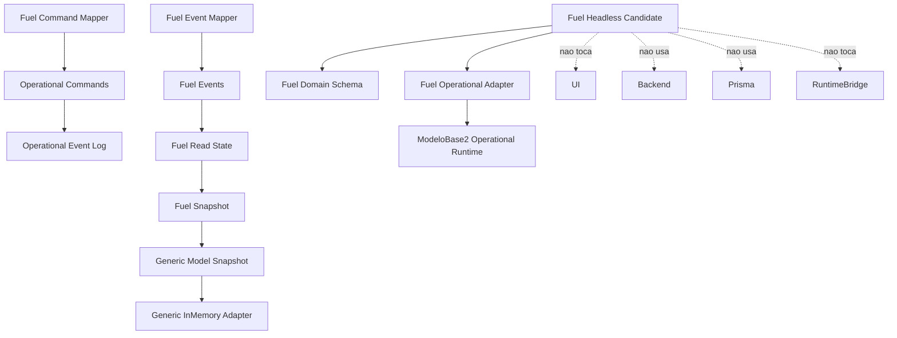
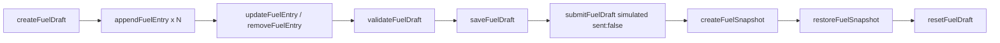
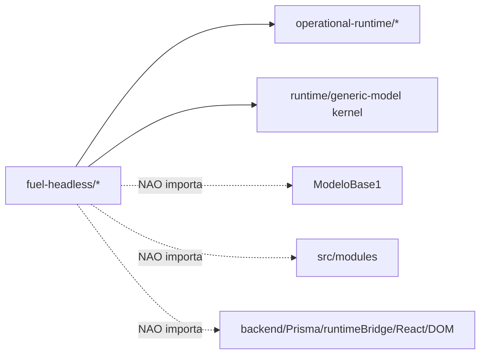

# Module Diagrams — ModeloBase2 Fuel Headless Candidate

```mermaid
flowchart TD
  FC[Fuel Headless Candidate] --> FS[Fuel Domain Schema]
  FC --> FA[Fuel Operational Adapter]
  FA --> RT[ModeloBase2 Operational Runtime]
  CM[Fuel Command Mapper] --> OC[Operational Commands]
  OC --> EL[Operational Event Log]
  EM[Fuel Event Mapper] --> FE[Fuel Events]
  FE --> RS[Fuel Read State]
  RS --> SN[Fuel Snapshot]
  SN --> GMS[Generic Model Snapshot]
  GMS --> MEM[Generic InMemory Adapter]
  FC -. nao toca .-> UI[UI]
  FC -. nao usa .-> BK[Backend]
  FC -. nao usa .-> PR[Prisma]
  FC -. nao toca .-> RB[RuntimeBridge]
```

## Ciclo fuel completo

```mermaid
flowchart LR
  A[createFuelDraft] --> B[appendFuelEntry x N]
  B --> C[updateFuelEntry / removeFuelEntry]
  C --> D[validateFuelDraft]
  D --> E[saveFuelDraft]
  E --> F[submitFuelDraft simulated sent:false]
  F --> G[createFuelSnapshot]
  G --> H[restoreFuelSnapshot]
  H --> I[resetFuelDraft]
```

## Camadas / isolamento

```mermaid
flowchart LR
  FUEL[fuel-headless/*] --> ORUN[operational-runtime/*]
  FUEL --> K[runtime/generic-model kernel]
  FUEL -. NAO importa .-> MB1[ModeloBase1]
  FUEL -. NAO importa .-> MOD[src/modules]
  FUEL -. NAO importa .-> RBK[backend/Prisma/runtimeBridge/React/DOM]
```
