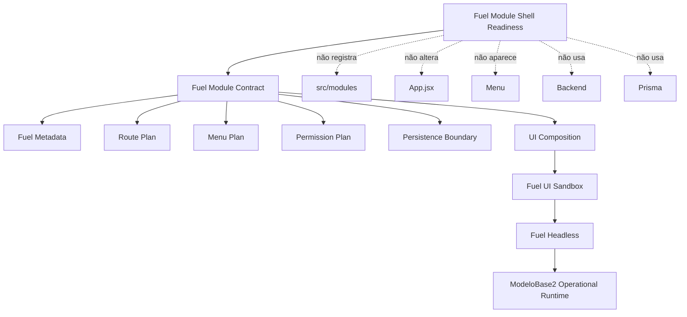

# Module Diagrams — Fuel Module Shell Readiness

## Leitura

- A **readiness** é o topo: compõe o contrato e todos os planos/boundaries.
- O **contrato** aponta para metadata, planos de rota/menu/permissão, persistence boundary e
  UI composition.
- A **UI composition** reutiliza o **Fuel UI Sandbox**, que consome o **Fuel Headless**, que roda
  sobre o **ModeloBase2 Operational Runtime**.
- As arestas tracejadas mostram tudo o que a readiness **não** faz: não registra módulo, não
  altera App.jsx, não aparece no menu, não usa backend nem Prisma.
