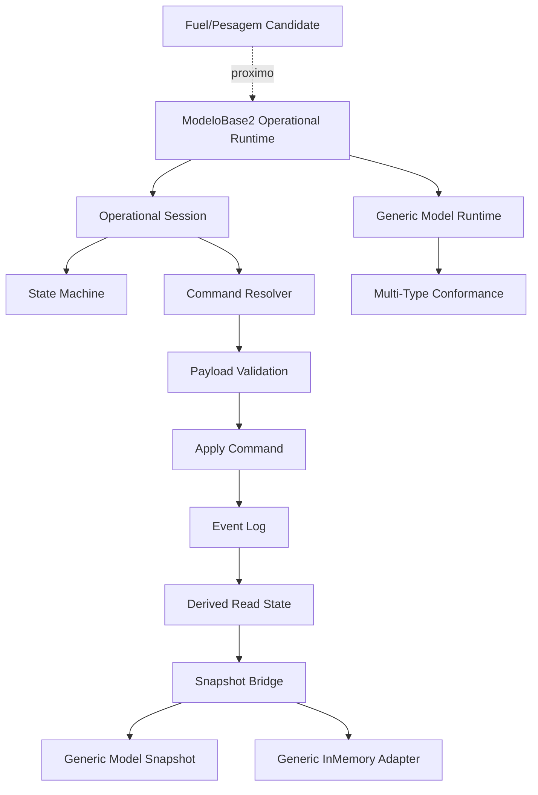
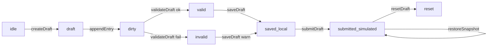

# Module Diagrams — ModeloBase2 Operational Runtime Foundation



## Ciclo local completo



## Composição / isolamento

```mermaid
flowchart LR
  OR[operational-runtime/*] --> PROTO[ModeloBase2 prototype-adapter]
  OR --> K[runtime/generic-model kernel]
  OR -. NÃO importa .-> MB1[ModeloBase1]
  OR -. NÃO importa .-> MOD[src/modules/empresas|cadcps]
  OR -. NÃO importa .-> RB[backend/Prisma/runtimeBridge/React]
```
