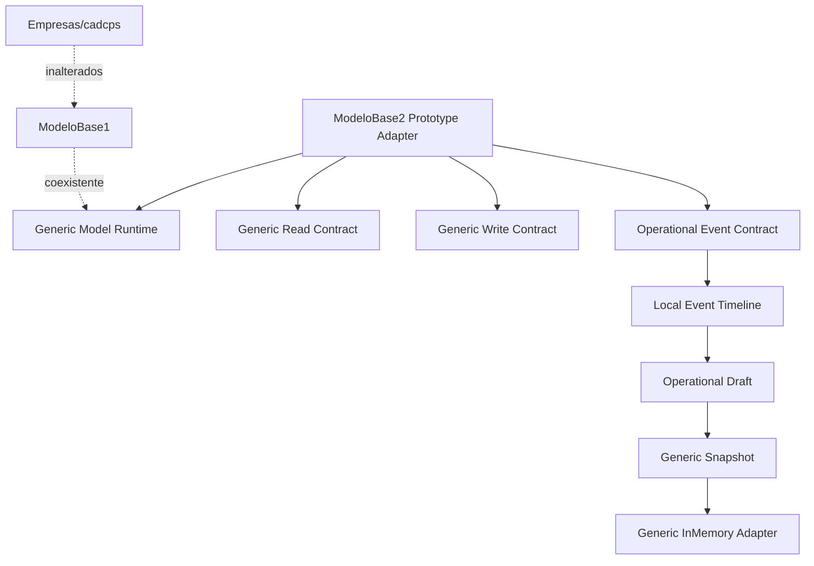
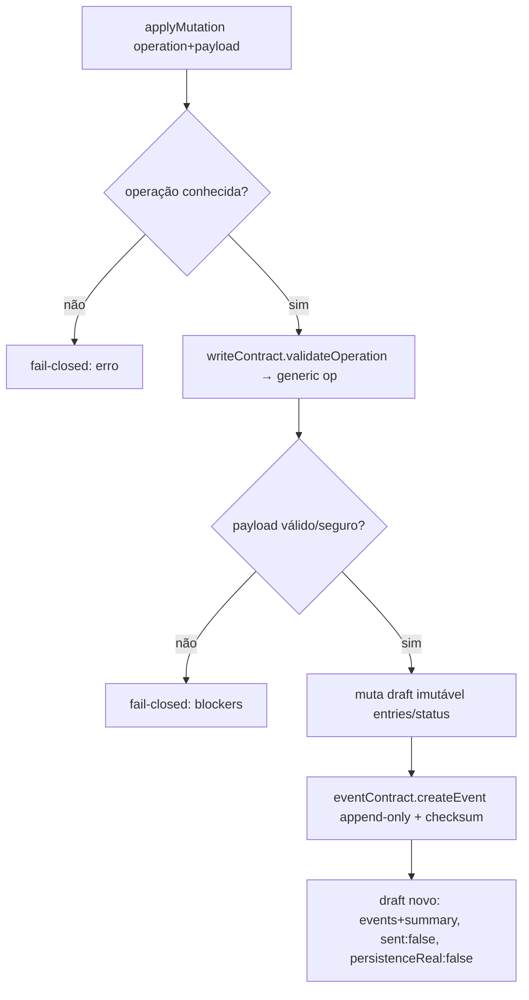

# Module Diagrams — ModeloBase2 Prototype Adapter



## Fluxo de mutation → evento



## Coexistência multi-tipo

```mermaid
flowchart LR
  K[runtime/generic-model kernel puro] --> A1[modeloBase1 adapter cadastro]
  K --> A2[modeloBase2 prototype adapter operacional]
  A1 -. table/form .-> K
  A2 -. entries/event timeline .-> K
  A2 -. NÃO importa .-> A1
  A2 -. NÃO importa .-> M[src/modules/empresas|cadcps]
```
