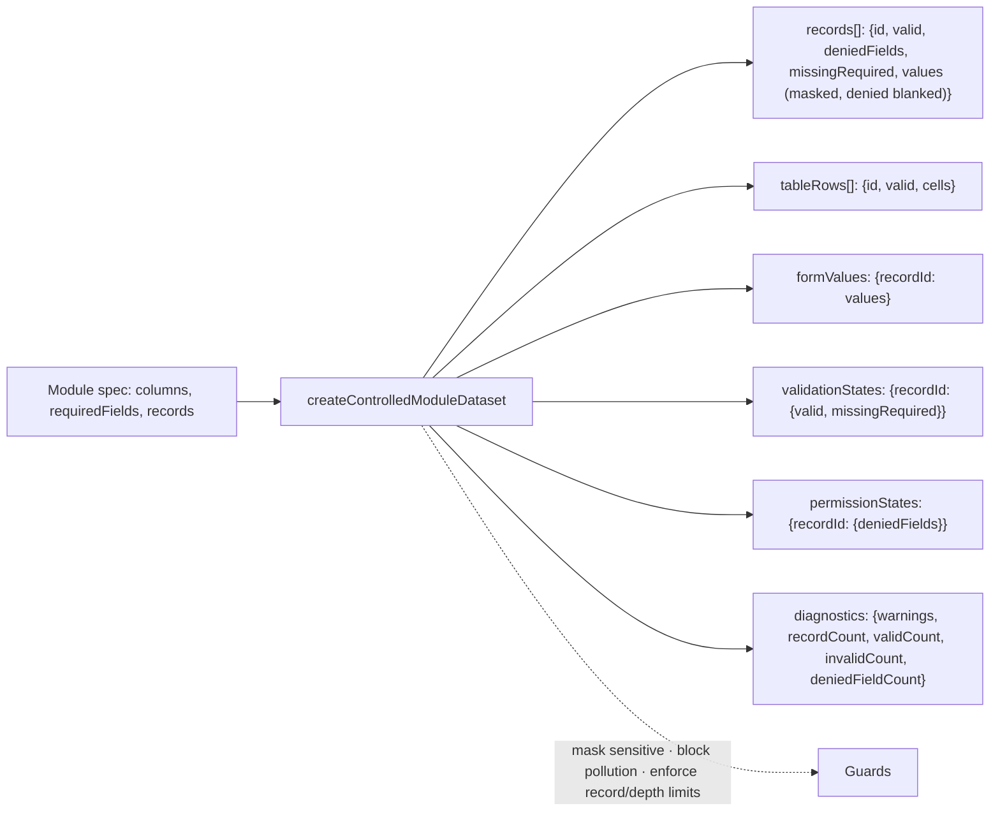
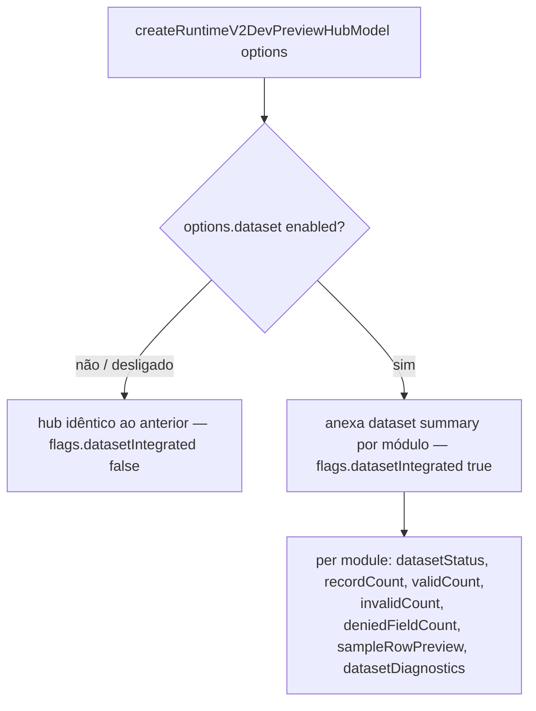

# Post-Foundation C — Module Diagrams

Runtime v2 Controlled Dev Dataset — position, flow, and isolation from production.

---

## Controlled dev dataset — safe simulated data

```mermaid
flowchart TB
  DS[Controlled Dev Dataset] --> EMP[Empresas Dataset]
  DS --> CAD[cadcps Dataset]
  DS --> HUB[Runtime v2 Dev Preview Hub]
  HUB --> SUM[Dataset Summary]

  EUI[Empresas UI real] -. não controlada .-> LEG[Runtime legado]
  CUI[cadcps UI real] -. não controlada .-> LEG

  DS -->|flag off default / produção| EMPTY[superfície vazia segura — getModules []]
  DS -->|flag on em dev| DATA[records / tableRows / formValues / diagnostics]
  DS -. sem banco, sem backend, sem Prisma, sem fetch, sem dados reais .-> SAFE[Mock seguro determinístico]
```

**Depends on:** the pure guards from `tableFormProjection.js` (masking/clone) + the module datasets. No React, no backend.
**Consumed by:** the dev preview hub (opt-in summary) and any dev harness. Never a public route, never in the menu, never real data.

---

## Dataset shape — plain, deterministic, controlled



Cada dataset traz registros válidos, inválidos (campo obrigatório vazio) e com campo negado — um conjunto controlado para validar previews.

---

## Hub integration — opt-in, zero effect when off



Com o dataset desligado (padrão) ou não fornecido, o hub é byte-idêntico ao anterior (31/31 testes do hub verdes) — a integração é estritamente aditiva e opt-in.
