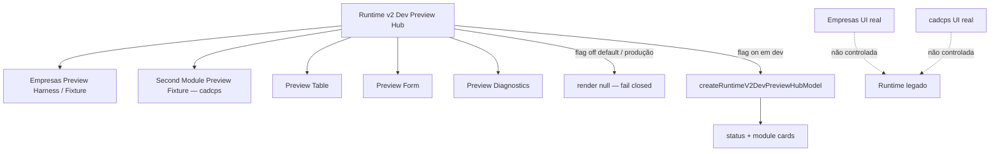
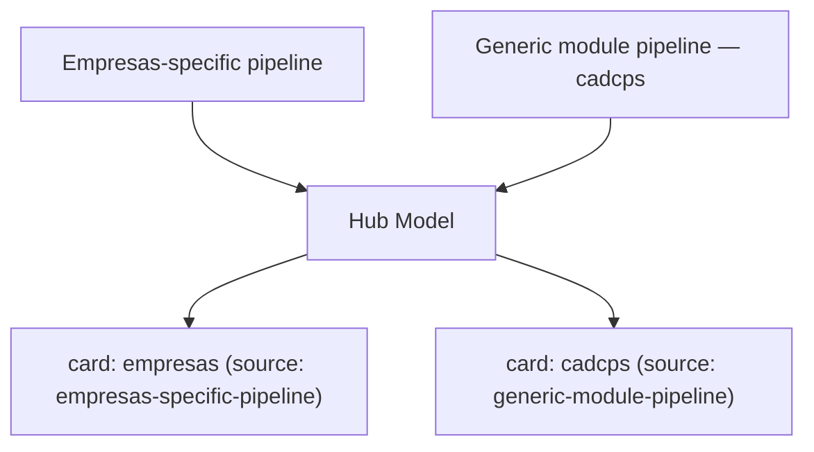
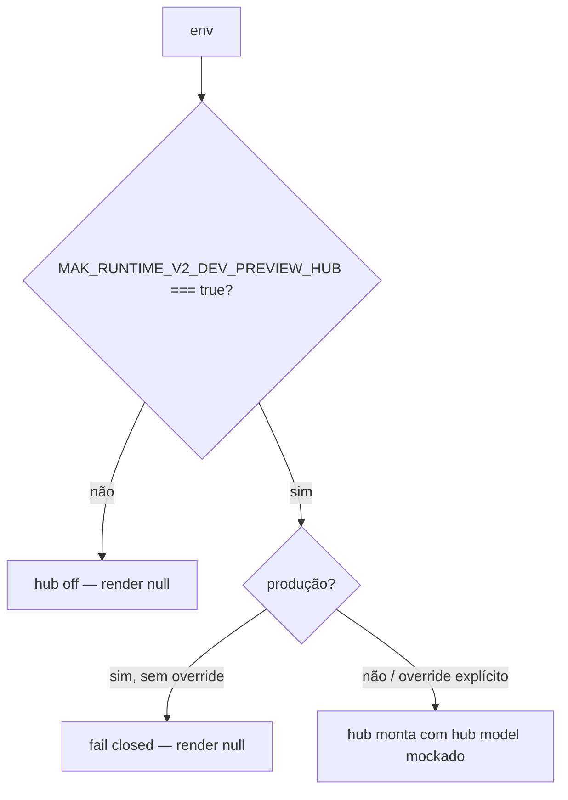

# Post-Foundation C — Module Diagrams

Runtime v2 Dev Preview Hub — position, flow, and isolation from production.

---

## Dev preview hub — aggregation wiring



**Depends on:** `createEmpresasDevPreviewFixture` (Empresas-specific) + `createSecondModuleDevPreviewFixture` (generic cadcps) + `createEmpresasDevPreviewModel`. The hub React components are never exported from the runtime barrel.
**Consumed by:** a manual dev harness mount only. Never a public production route, never in the main menu, never auto-mounted.

---

## Hub model — plain, deterministic, mocked

```mermaid
flowchart LR
  BUILD[createRuntimeV2DevPreviewHubModel] --> STATUS["status {enabled, devOnly, moduleCount, mocked}"]
  BUILD --> ENV[environment: development|production]
  BUILD --> FLAGS[flags {hubFlag, hubEnabled}]
  BUILD --> MODS["modules[]: empresas + cadcps"]
  BUILD --> DIAG["diagnostics {warnings, totalModules, availableModules}"]
  BUILD --> LIM["limitations[] (dev-only / mocked / passive)"]
  MODS --> ENTRY["per module:\ntable summary, form summary,\ndiagnostics, differences,\nactions/workflows (metadata), masked metadata"]
  BUILD -. objeto plano, sem $$typeof, JSON-safe, cópia segura .-> SAFE[Sem React / sem DOM]
```

Per-module build failure is captured into that module's entry (`ok:false`) — the hub never crashes because one module misbuilds.

---

## Genericity — two pipelines, one hub



O hub prova que o pipeline específico de Empresas e o pipeline genérico (cadcps) coexistem — o caminho para adicionar um terceiro módulo é fornecer sua fixture ao builder do hub.

---

## Isolation & opt-in gating



Sem rota, sem menu; `src/App.jsx` intocado. Com a flag desligada (padrão) ou em produção sem override, o hub renderiza `null` — efeito zero.
