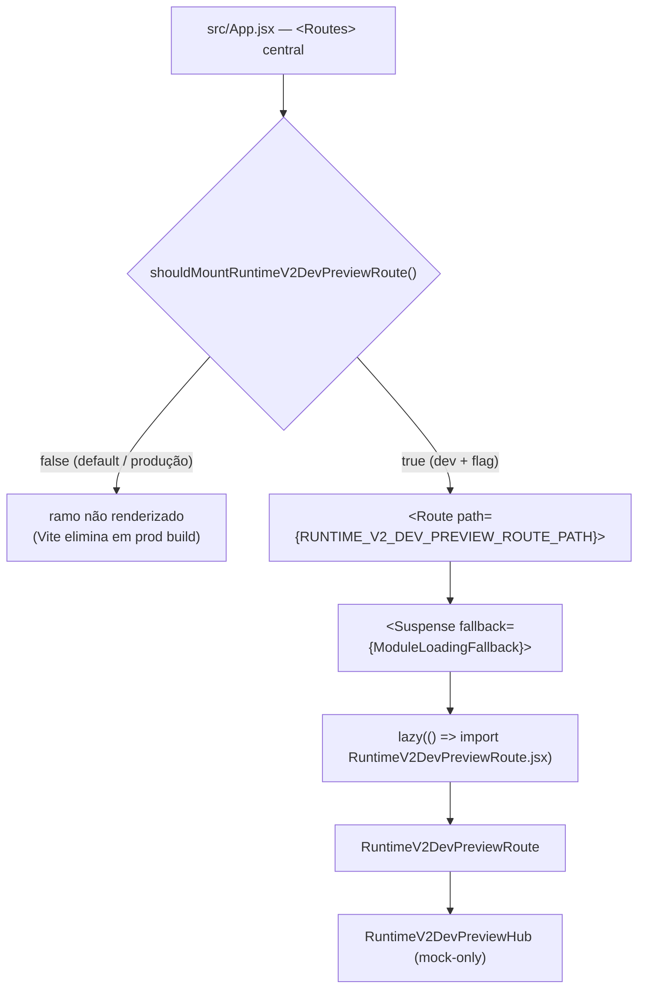
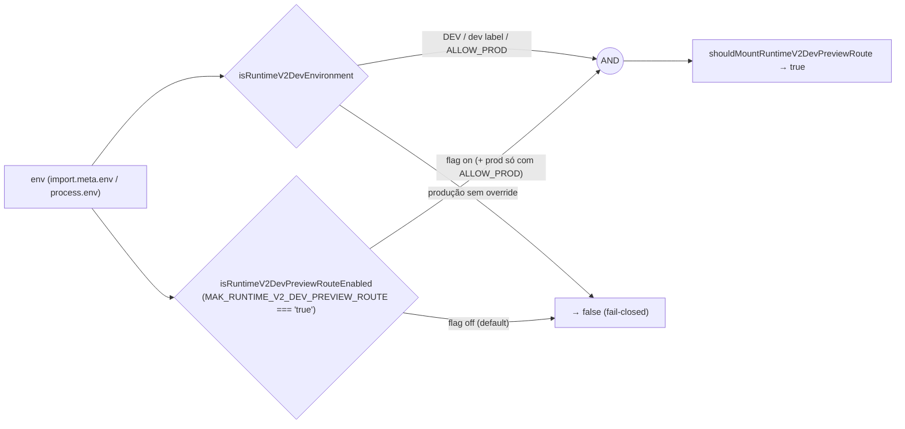
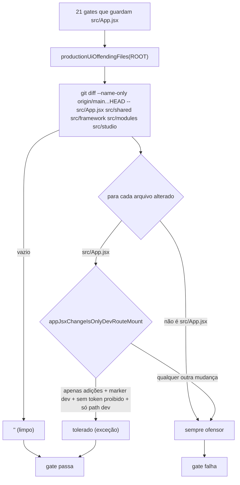
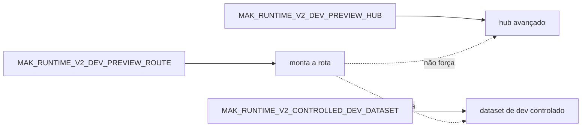

# Post-Foundation C — Module Diagrams

**Slice:** Post-Foundation C — Runtime v2 Dev Preview Route Activation

---

## 1. Ativação da rota no roteador central (`src/App.jsx`)

## 2. Gate de montagem (dev-only, fail-closed em produção)

## 3. Guard de produção compartilhado (exceção precisa, não genérica)

## 4. Independência de flags (hub / dataset / rota)

