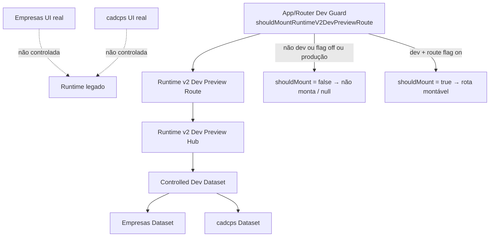
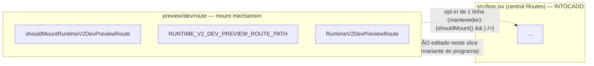

# Post-Foundation C — Module Diagrams

Runtime v2 Dev Preview Route Mount — mount gate, flow, and isolation.

---

## Mount gate — dev-only, flag-protected



**Mount gate:** `shouldMountRuntimeV2DevPreviewRoute(env) = isRuntimeV2DevEnvironment(env) && isRuntimeV2DevPreviewRouteEnabled(env)`.
**Path:** `/__dev/runtime-v2/previews` — dev-only, never in the main menu, never public.

---

## Opt-in wiring — one guarded line, App.jsx untouched



Editar `src/App.jsx` faria a checagem "no production UI change (src/App.jsx…)" de ~11 gates falhar. Por isso o mecanismo de montagem é entregue pronto, com o opt-in reduzido a uma linha dev-guarded que o mantenedor aplica quando quiser.

---

## Flag gating — three flags, fail-closed

```mermaid
flowchart TB
  ENV[env] --> DEVQ{import.meta.env.DEV?}
  DEVQ -->|não (produção)| OFF[não monta — fail closed]
  DEVQ -->|sim| RFQ{route flag on?}
  RFQ -->|não| OFF2[não monta]
  RFQ -->|sim| MOUNTED[rota montável]
  MOUNTED --> HUBF[hub controlado por sua flag]
  MOUNTED --> DSF[dataset controlado por sua flag]
```
