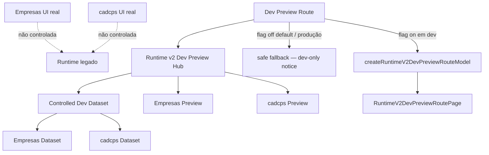
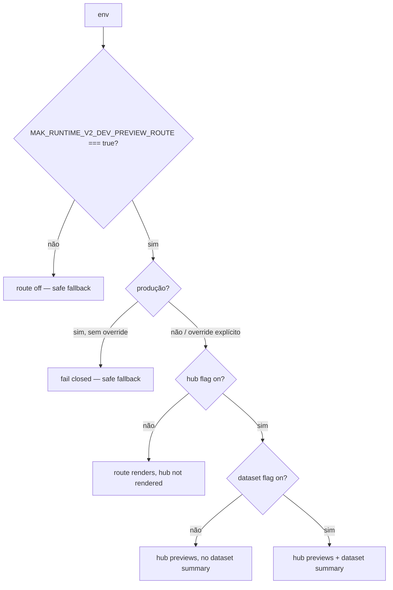
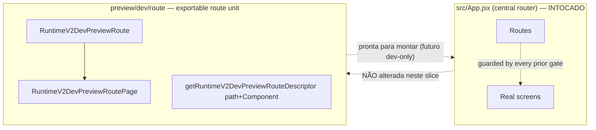

# Post-Foundation C — Module Diagrams

Runtime v2 Dev Preview Route — position, flow, and isolation from production.

---

## Dev preview route — dev-only, flag-protected

**Path:** `/__dev/runtime-v2/previews` — dev-only, declared as a constant/descriptor, NOT mounted into the production router or main menu.
**Depends on:** the hub model builder + controlled dataset (opt-in). The route React components are never exported from the runtime barrel and never wired into `src/App.jsx`.

---

## Flag gating — three flags, fail-closed

---

## Wiring decision — exportable, not mounted

Montar a rota em `src/App.jsx` faria a checagem "no production UI change (src/App.jsx…)" de todos os gates anteriores falhar. Por isso a rota é entregue como unidade exportável e auto-protegida, com o path correto, pronta para montar — sem alterar `src/App.jsx`.
