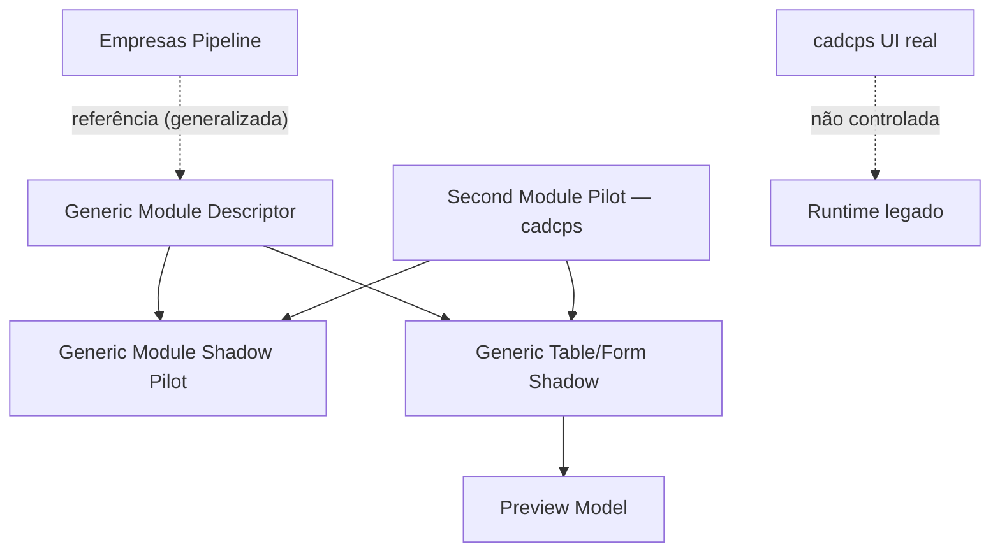
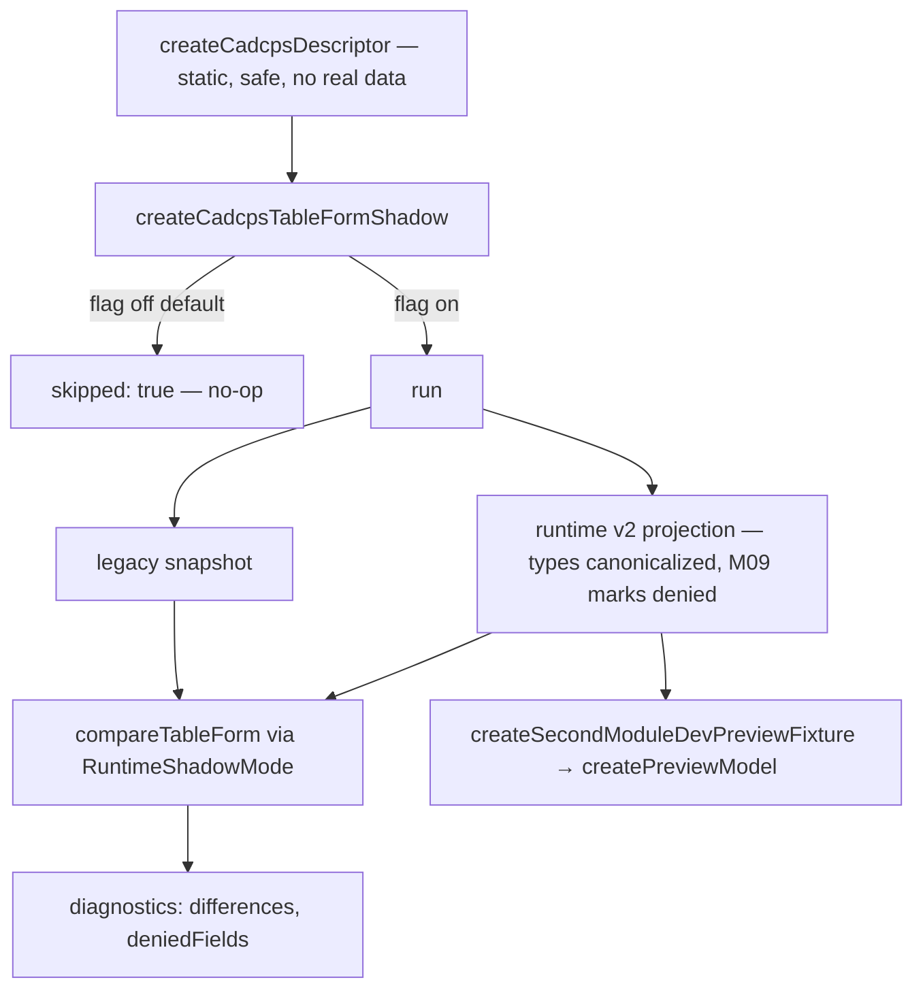

# Post-Foundation C — Module Diagrams

Generic Module Shadow Runtime + Second Module (cadcps) Pilot — reusable architecture, isolated from production.

---

## Generic module runtime — reusable base



**Depends on:** `RuntimeShadowMode`, Observability, Runtime Completion (quando injetados) — nunca reimplementa permission/validation/render.
**Consumed by:** o segundo módulo (cadcps) e qualquer módulo CRUD futuro via um descriptor estático + flag. Nunca consumido pelo render de produção, Studio ou Marketplace.

---

## What was extracted vs what stays module-specific

```mermaid
flowchart LR
  subgraph Generic["Genérico (extraído de Empresas)"]
    G1[Shadow pilot algorithm]
    G2[Table/form projection algorithm]
    G3[Guards: pollution / masking / safe clone]
    G4[V2 type canonicalization + comparison]
  end
  subgraph Specific["Específico do módulo"]
    S1[Static descriptor\n(createCadcpsDescriptor / Empresas descriptor)]
    S2[Opt-in flag name\n(MAK_RUNTIME_V2_SHADOW_CADCPS)]
  end
  Specific --> Generic
```

A base genérica recebe um `GenericModuleDescriptor` + nome de flag; tudo o mais é compartilhado. Um terceiro módulo entra fornecendo apenas um descriptor estático e uma flag.

---

## Second module flow (cadcps) — passive, opt-in



Com a flag desligada (padrão), `run()` é no-op. Nenhuma tela real do cadcps é tocada; `src/App.jsx`/menu permanecem intocados.
