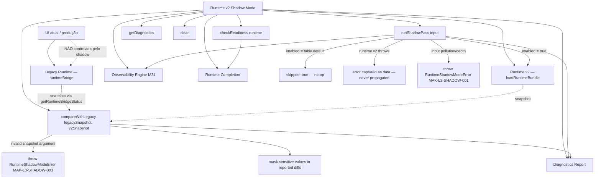
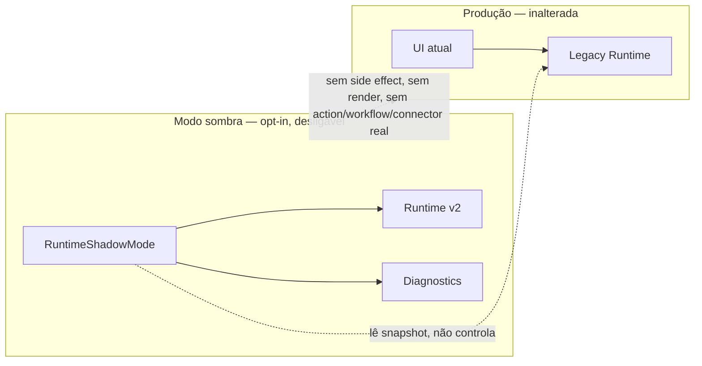
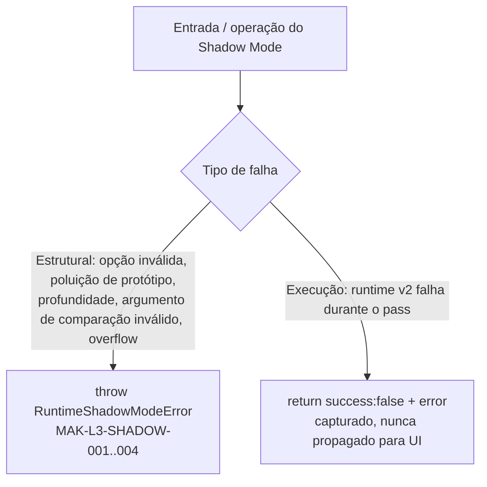

# Post-Foundation C — Module Diagrams

Runtime v2 Shadow Mode — position, dependencies, and isolation from production UI.

---

## Shadow Mode — parallel diagnostics, not migration

**Depends on (all optional/injectable):** `loadRuntime` (host-supplied builder of a runtime v2 result), Observability Engine (M24), Runtime Completion. None are mandatory — with none wired, Shadow Mode still constructs and short-circuits safely when disabled.
**Consumed by:** future host wiring behind a feature flag (a pilot module in shadow mode). Never consumed by production UI, Studio, or Marketplace.

---

## Isolation guarantee

Com `enabled: false` (padrão), o bloco Shadow é inerte: `runShadowPass()` retorna `{ skipped: true }`. Nenhuma tela real passa a depender do runtime v2; nenhuma ação de usuário muda.

---

## Two-tier failure model

Falhas do próprio adaptador (contrato/segurança) são lançadas para o desenvolvedor; falhas do runtime v2 sob diagnóstico são isoladas como dado — a fronteira que garante que o modo sombra nunca possa derrubar produção.
