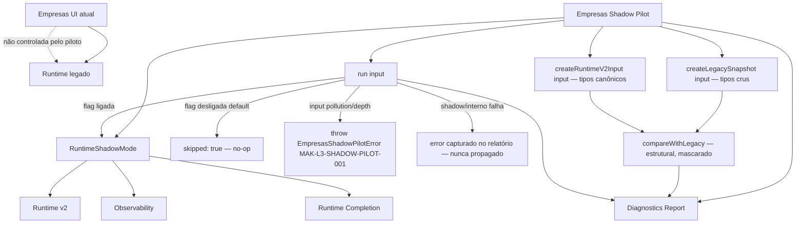
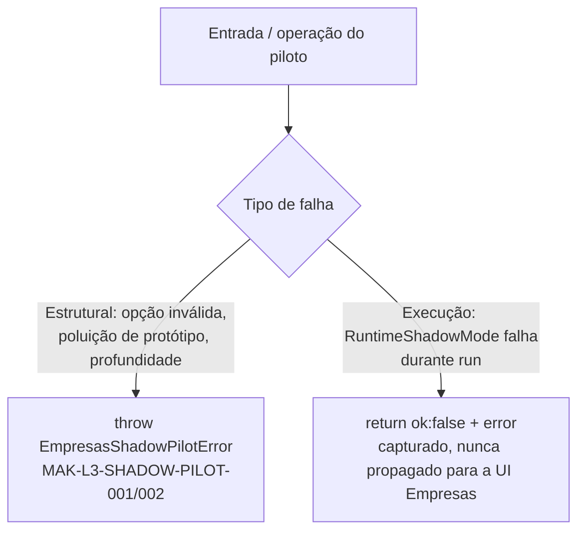

# Post-Foundation C — Module Diagrams

Empresas Runtime v2 Shadow Pilot — position, flow, and isolation from the production Empresas screen.

---

## Empresas Shadow Pilot — passive diagnostic wiring



**Depends on (all optional/injectable):** `RuntimeShadowMode` (default construído internamente com `enabled: true`), Observability, Runtime Completion, `loadRuntimeV2`. Nenhum obrigatório.
**Consumed by:** um futuro hook passivo e feature-flagged da UI Empresas. Nunca consumido diretamente pelo render de produção, Studio ou Marketplace.

---

## Decoupling — runtime não importa o módulo

```mermaid
flowchart LR
  subgraph Runtime["src/runtime — camada runtime"]
    ESP2[EmpresasShadowPilot] --> DESC[EMPRESAS_DEFAULT_DESCRIPTOR\ndescritor estrutural passivo]
    ESP2 -. aceita override .-> INPUT[input do chamador\n(field defs vivos, futuro)]
  end

  subgraph Module["src/modules/empresas — UI de produção"]
    EMPUI[CadastroEmpresas / EMP_FORM_FIELD_DEFS]
  end

  Runtime -. NÃO importa .-> Module
  Module -. poderia (futuro) entregar input passivo .-> Runtime
```

O runtime nunca importa `src/modules/empresas/*` nem `src/App.jsx` (isso inverteria a camada). O descritor canônico vive no runtime; a UI real poderá, no futuro, entregar seus field defs como `input` sem criar dependência runtime→módulo. Verificado por teste e gate.

---

## Legacy vs Runtime v2 — structural drift surfaced

```mermaid
flowchart TB
  DESC2[Descritor Empresas] --> L[createLegacySnapshot]
  DESC2 --> V[createRuntimeV2Input]
  L -->|tipos crus: tel, cpf_cnpj, text| LSNAP2[Legacy Snapshot]
  V -->|canônicos: phone, document, string| VSNAP2[Runtime v2 Snapshot]
  LSNAP2 --> CMP2[compareWithLegacy]
  VSNAP2 --> CMP2
  CMP2 --> REPORT[equivalent + differences\n(path: fields quando há drift)]
```

O piloto revela, de forma determinística e controlada, o drift de normalização de tipos entre o que o runtime legado representa e o que o runtime v2 produziria — sem tocar nenhum dado real ou tela.

---

## Two-tier failure model


