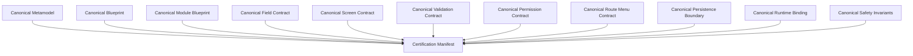
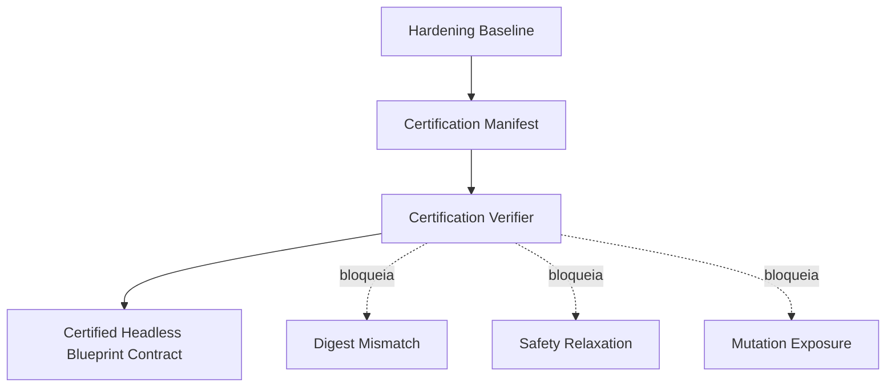
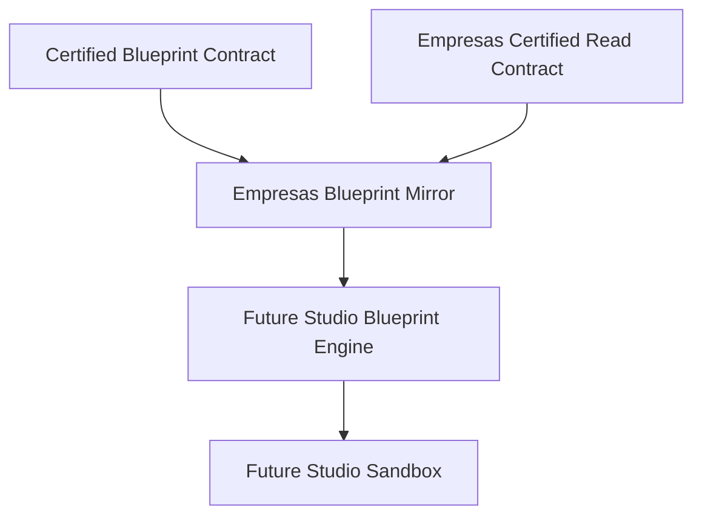
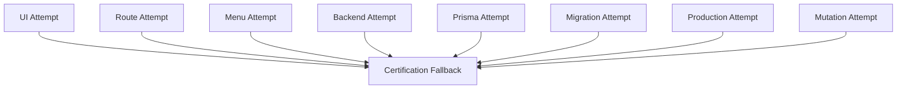

# MODULE DIAGRAMS

## Diagrama 1 — canônicos → manifest

```mermaid
graph TD
  CM[Canonical Metamodel] --> MAN[Certification Manifest]
  CB[Canonical Blueprint] --> MAN
  CMB[Canonical Module Blueprint] --> MAN
  CF[Canonical Field Contract] --> MAN
  CS[Canonical Screen Contract] --> MAN
  CV[Canonical Validation Contract] --> MAN
  CP[Canonical Permission Contract] --> MAN
  CRM[Canonical Route Menu Contract] --> MAN
  CPB[Canonical Persistence Boundary] --> MAN
  CRB[Canonical Runtime Binding] --> MAN
  CSI[Canonical Safety Invariants] --> MAN
```

## Diagrama 2 — baseline + verifier

```mermaid
graph TD
  HB[Hardening Baseline] --> MAN[Certification Manifest]
  MAN --> V[Certification Verifier]
  V --> CERT[Certified Headless Blueprint Contract]
  V -. bloqueia .-> DM[Digest Mismatch]
  V -. bloqueia .-> SR[Safety Relaxation]
  V -. bloqueia .-> ME[Mutation Exposure]
```

## Diagrama 3 — futuro Empresas mirror

```mermaid
graph TD
  CERT[Certified Blueprint Contract] --> EBM[Empresas Blueprint Mirror]
  ECR[Empresas Certified Read Contract] --> EBM
  EBM --> ENG[Future Studio Blueprint Engine]
  ENG --> SBX[Future Studio Sandbox]
```

## Diagrama 4 — fallback fail-closed

```mermaid
graph TD
  UI[UI Attempt] --> CF[Certification Fallback]
  RT[Route Attempt] --> CF
  MN[Menu Attempt] --> CF
  BK[Backend Attempt] --> CF
  PR[Prisma Attempt] --> CF
  MG[Migration Attempt] --> CF
  PD[Production Attempt] --> CF
  MU[Mutation Attempt] --> CF
```
