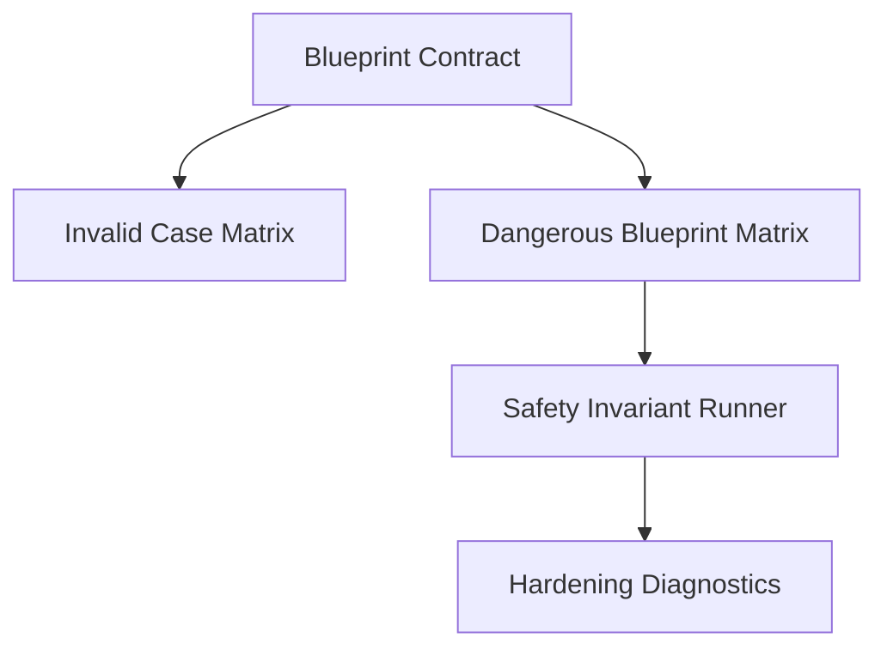
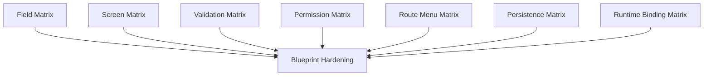
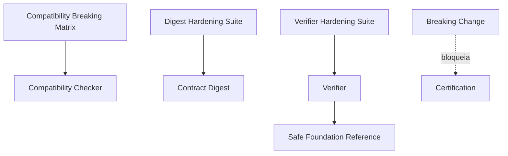
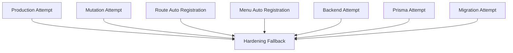

# MODULE DIAGRAMS

## Diagrama 1 — casos e safety

```mermaid
graph TD
  BC[Blueprint Contract] --> ICM[Invalid Case Matrix]
  BC --> DBM[Dangerous Blueprint Matrix]
  DBM --> SIR[Safety Invariant Runner]
  SIR --> HD[Hardening Diagnostics]
```

## Diagrama 2 — matrizes de blueprint

```mermaid
graph TD
  FM[Field Matrix] --> BH[Blueprint Hardening]
  SM[Screen Matrix] --> BH
  VM[Validation Matrix] --> BH
  PM[Permission Matrix] --> BH
  RM[Route Menu Matrix] --> BH
  PT[Persistence Matrix] --> BH
  RB[Runtime Binding Matrix] --> BH
```

## Diagrama 3 — compatibilidade e integridade

```mermaid
graph TD
  CBM[Compatibility Breaking Matrix] --> CC[Compatibility Checker]
  DHS[Digest Hardening Suite] --> CD[Contract Digest]
  VHS[Verifier Hardening Suite] --> V[Verifier]
  V --> SFR[Safe Foundation Reference]
  BRK[Breaking Change] -. bloqueia .-> CERT[Certification]
```

## Diagrama 4 — fallback fail-closed

```mermaid
graph TD
  PA[Production Attempt] --> HF[Hardening Fallback]
  MA[Mutation Attempt] --> HF
  RA[Route Auto Registration] --> HF
  MEN[Menu Auto Registration] --> HF
  BA[Backend Attempt] --> HF
  PRA[Prisma Attempt] --> HF
  MIG[Migration Attempt] --> HF
```
