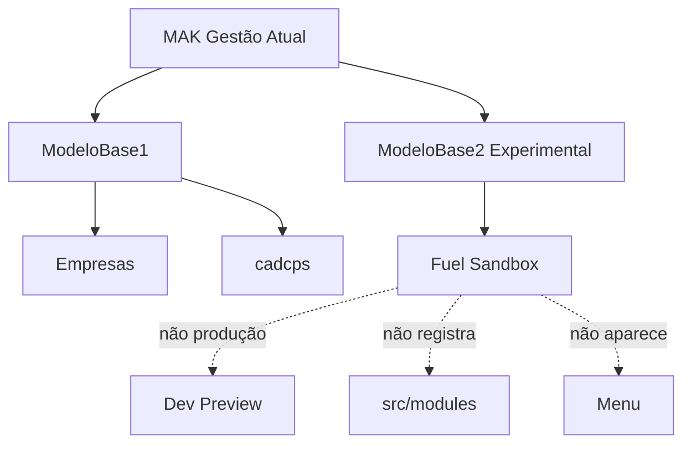
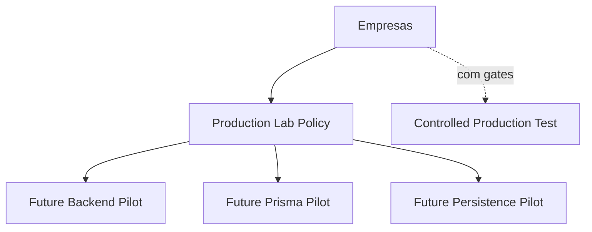
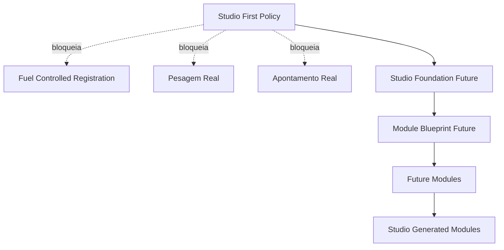

# Module Diagrams — Studio-First Module Policy & Experimental Base Reconciliation

## Diagrama 1 — Blocos atuais e limites

## Diagrama 2 — Empresas como laboratório real controlado

## Diagrama 3 — Política Studio-first

## Leitura

- **Produção** flui por ModeloBase1 → Empresas / cadcps.
- **Experimental** flui por ModeloBase2 → Fuel Sandbox, sem tocar produção (arestas tracejadas).
- **Empresas** é o único caminho autorizado para pilotos reais de backend/Prisma/persistência,
  sempre atrás de gates e slices explícitos.
- **Studio First Policy** bloqueia registro real até Studio Foundation + Module Blueprint
  amadurecerem; a partir daí, módulos futuros nascem gerados pelo Studio.
