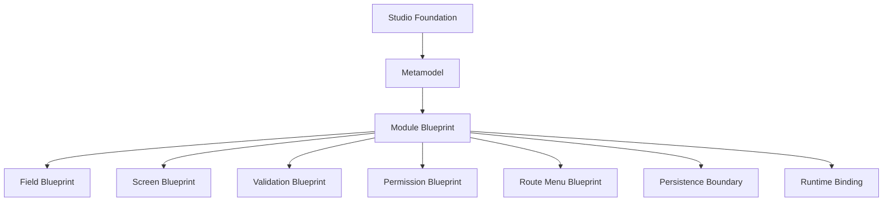
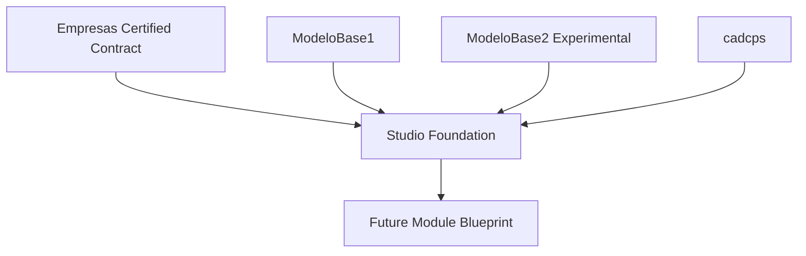
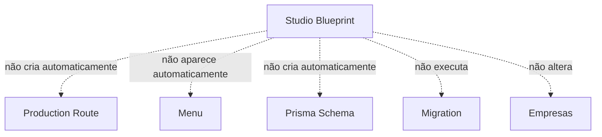
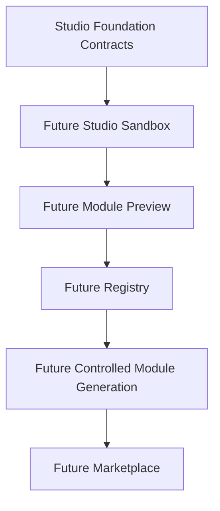

# Module Diagrams — Studio Foundation Audit

## Diagrama 1 — Fundação → blueprints

## Diagrama 2 — Fontes da fundação

## Diagrama 3 — O que o blueprint NÃO faz automaticamente

## Diagrama 4 — Roadmap

