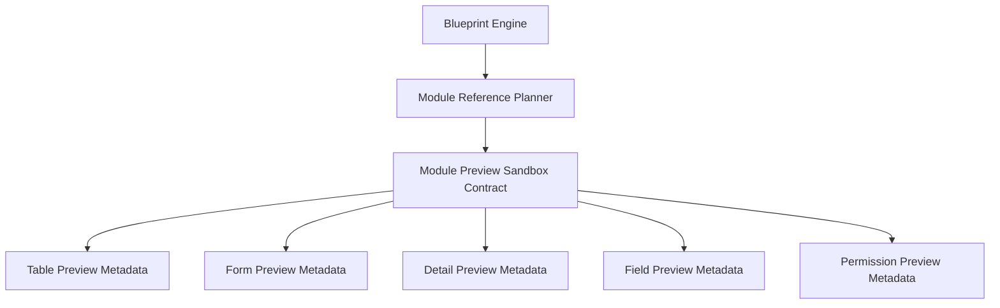
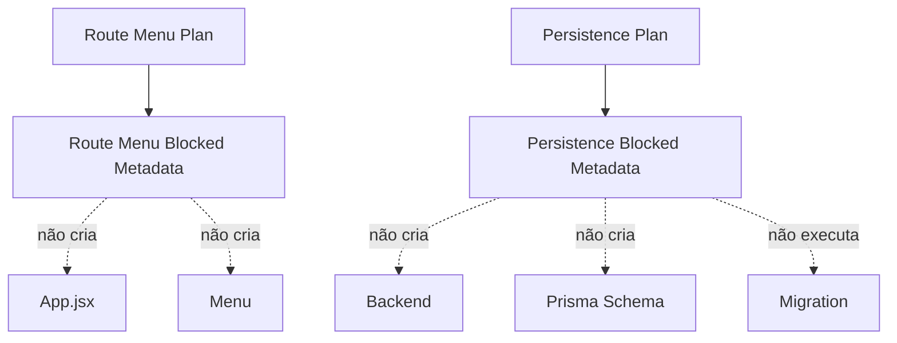
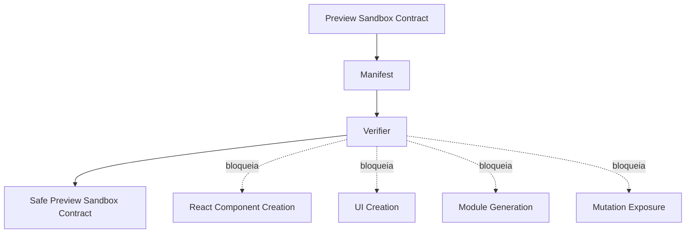
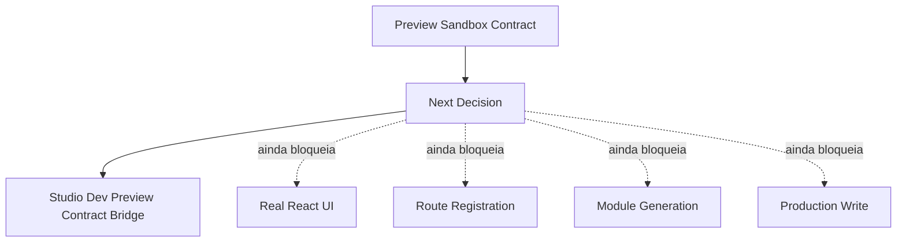

# Module Diagrams

```mermaid
flowchart TD
  A[Blueprint Engine] --> B[Module Reference Planner]
  B --> C[Module Preview Sandbox Contract]
  C --> D[Table Preview Metadata]
  C --> E[Form Preview Metadata]
  C --> F[Detail Preview Metadata]
  C --> G[Field Preview Metadata]
  C --> H[Permission Preview Metadata]
```

```mermaid
flowchart TD
  A[Route Menu Plan] --> B[Route Menu Blocked Metadata]
  C[Persistence Plan] --> D[Persistence Blocked Metadata]
  B -. não cria .-> E[App.jsx]
  B -. não cria .-> F[Menu]
  D -. não cria .-> G[Backend]
  D -. não cria .-> H[Prisma Schema]
  D -. não executa .-> I[Migration]
```

```mermaid
flowchart TD
  A[Preview Sandbox Contract] --> B[Manifest]
  B --> C[Verifier]
  C --> D[Safe Preview Sandbox Contract]
  C -. bloqueia .-> E[React Component Creation]
  C -. bloqueia .-> F[UI Creation]
  C -. bloqueia .-> G[Module Generation]
  C -. bloqueia .-> H[Mutation Exposure]
```

```mermaid
flowchart TD
  A[Preview Sandbox Contract] --> B[Next Decision]
  B --> C[Studio Dev Preview Contract Bridge]
  B -. ainda bloqueia .-> D[Real React UI]
  B -. ainda bloqueia .-> E[Route Registration]
  B -. ainda bloqueia .-> F[Module Generation]
  B -. ainda bloqueia .-> G[Production Write]
```
