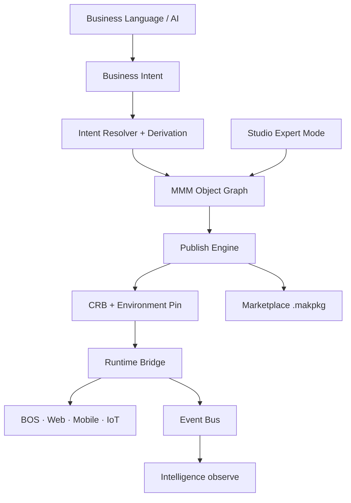

# 00 — Meta Model Overview

**Status:** Official · Entry point  
**Version:** 1.0.0 · **Effective:** 2026-06-30 · **Mission:** 4.01.1 · **Decision:** D-MMM-15

---

## Objetivo

Introduzir o MAK Universal Meta Model (MMM) como núcleo da plataforma Low Code Enterprise.

## Escopo

Visão geral; detalhes em documentos especializados ([README](./README.md)).

## Responsabilidades

Este documento orienta leitura; **não** duplica especificações de outros docs.

## Conceitos

- **MMM:** Grafo tipado de **227 objectTypes** (**226 PlatformSchemas**), versionado, tenant-scoped
- **CRB:** Única entrada do Runtime
- **Authoring:** Business Language → Intent → MMM objects

## Modelo

Plataforma organizada em camadas: Authoring → MMM → Publish → Runtime → Experience. Ver [01-CORE-ARCHITECTURE.md](./01-CORE-ARCHITECTURE.md).

## Regras

Ver [RULES.md](./RULES.md) — princípios P-01–P-10.

## Fluxos

## Exemplos

Usuário descreve "controlar produtos com estoque mínimo" → Intent → BusinessObject + Fields + Automation → Publish → Tela funcional sem código.

## Restrições

- ERP só após MMM foundation (Program 4.15+)
- Nenhuma implementação antes de 4.02 Specification

## Integrações

| Subsistema | Doc |
|------------|-----|
| Persistence | [24-PERSISTENCE.md](./24-PERSISTENCE.md) |
| Runtime | [16-RUNTIME.md](./16-RUNTIME.md) |
| Studio | [08-PRESENTATION-LAYER.md](./08-PRESENTATION-LAYER.md) |
| Marketplace | [19-MARKETPLACE.md](./19-MARKETPLACE.md) |

## Versionamento

| Version | Date |
|---------|------|
| 1.0.0 | 2026-06-30 |

## Próximos passos

1. [GLOSSARY.md](./GLOSSARY.md) · 2. [RULES.md](./RULES.md) · 3. [02-OBJECT-TAXONOMY.md](./02-OBJECT-TAXONOMY.md)
