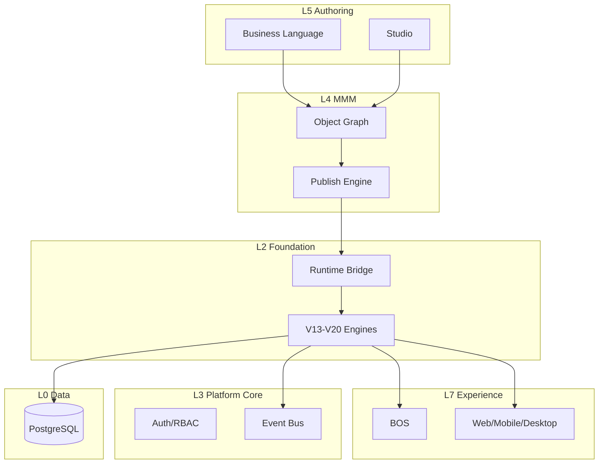

# 01 — Core Architecture

**Status:** Official · **Version:** 1.0.0 · **Mission:** 4.01.1 · **Decision:** D-MMM-01

---

## Objetivo

Definir posicionamento do MMM nas camadas L0–L7 da plataforma MAK.

## Escopo

Topologia de camadas; fronteiras; não cobre objectTypes (ver [02](./02-OBJECT-TAXONOMY.md)).

## Responsabilidades

Owner da **layer model** MMM-centric.

## Conceitos

| Layer | Component | MMM role |
|-------|-----------|----------|
| L7 Experience | BOS, Web, Mobile | Consome CRB |
| L6 Services | Marketplace, AI, Sync | Packages, AI Gateway |
| L5 Studio | Designers | Edita MMM via API |
| **L4 MMM** | Object graph + Publish | **SSOT definitions** |
| L3 Platform Core | Auth, Event Bus, Jobs | Enforces; transports |
| L2 Foundation | ModeloBase1, V13–V20 | Executes CRB |
| L1 Modules | Thin runtime hooks | Exception code only |
| L0 Data | PostgreSQL, Storage | Records |

## Modelo

## Regras

P-10 Layer Immutability; R-16 Foundation executes only.

## Fluxos

Authoring → MMM write (draft) → Publish → CRB → Runtime → Records.

## Exemplos

MDP (legacy L4) becomes persistence substrate under MMM ([24-PERSISTENCE.md](./24-PERSISTENCE.md)).

## Restrições

Foundation code frozen (D-MMM-13). Master architecture: [MAK-2035-MASTER-ARCHITECTURE.md](../architecture/MAK-2035-MASTER-ARCHITECTURE.md).

## Integrações

[CONTRACTS.md](./CONTRACTS.md) · [16-RUNTIME.md](./16-RUNTIME.md)

## Versionamento

1.0.0 · 2026-06-30

## Próximos passos

[02-OBJECT-TAXONOMY.md](./02-OBJECT-TAXONOMY.md)
