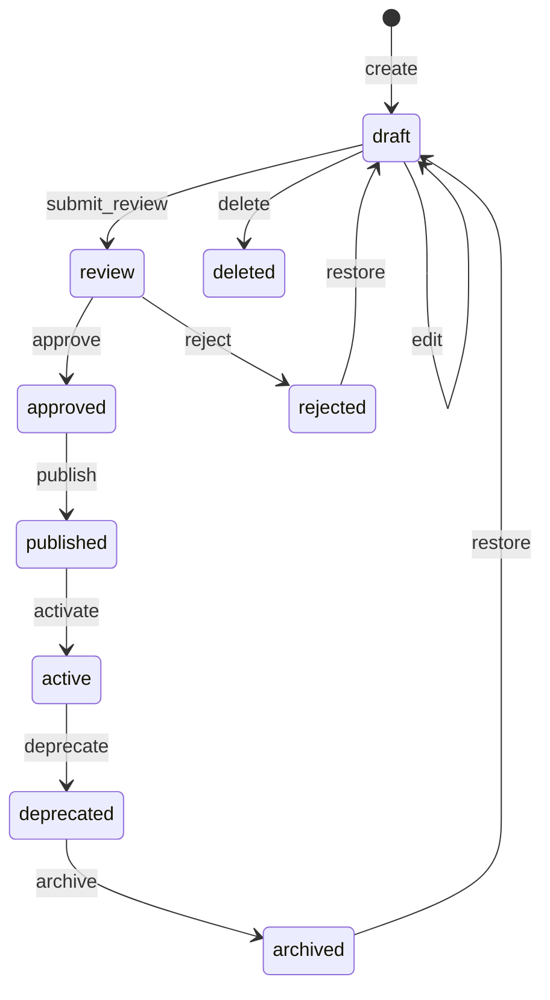
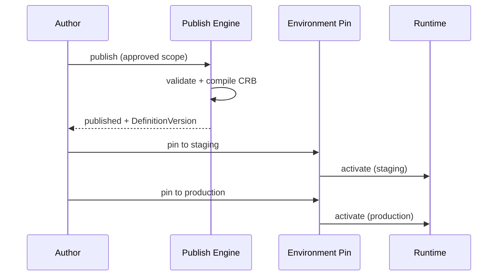

# 03 — Object Lifecycle

> **Status:** Official SSOT · Program 4.01.1  
> **Owner topic:** MMM object states and operations  
> **Related:** [04-OBJECT-DEPENDENCIES.md](./04-OBJECT-DEPENDENCIES.md) · [17-PUBLISH-PIPELINE.md](./17-PUBLISH-PIPELINE.md) · [RULES.md](./RULES.md)

---

## Objetivo

Definir os **estados**, **transições** e **operações** canônicas de todo objeto MMM — garantindo auditabilidade, publish controlado e rollback.

---

## Escopo

| In scope | Out of scope |
|----------|--------------|
| 9 estados canônicos | Record (L0) lifecycle |
| 14 operações | User session lifecycle |
| Transições válidas | Database row locking |
| Side-effects por operação | CRB runtime cache TTL |

---

## Responsabilidades

| Actor | Responsibility |
|-------|----------------|
| Studio | Transitions via API (draft → review) |
| Publish Engine | validate, publish, archive |
| Marketplace | install (creates draft with lineage) |
| Intelligence | Recommend only — no state mutation |
| Runtime | Read published/active only |

---

## Conceitos

- **Status** — posição no ciclo de vida (enum).
- **Operation** — ação explícita que causa transição.
- **Lineage** — preservada em todas as transições (R-07).
- **DefinitionVersion** — criada na operação `publish`.

---

## Modelo

### Estados (9)

| Status | Description | Visible in Runtime |
|--------|-------------|-------------------|
| `draft` | Work in progress | No |
| `review` | Awaiting human approval | No |
| `approved` | Approved, not yet published | No |
| `published` | In DefinitionVersion, CRB pending/active | Yes (after pin) |
| `active` | Current production pin | Yes |
| `deprecated` | Superseded, still readable | Yes (read-only) |
| `archived` | Removed from active compile scope | No |
| `rejected` | Review failed | No |
| `deleted` | Soft delete (audit retained) | No |

### Operações (14)

| Operation | From → To | Actor |
|-----------|-------------|-------|
| `create` | — → draft | Studio, Import, AI→Intent |
| `edit` | draft → draft | Studio |
| `submit_review` | draft → review | Author |
| `approve` | review → approved | Reviewer |
| `reject` | review → rejected | Reviewer |
| `publish` | approved → published | Publish Engine |
| `activate` | published → active | Environment Pin |
| `deprecate` | active → deprecated | Publish (new version) |
| `archive` | deprecated → archived | Admin |
| `restore` | archived/rejected → draft | Admin |
| `clone` | any → draft (new objectId lineage) | Studio, Marketplace |
| `fork` | published → draft (new branch) | Studio |
| `rollback` | active → deprecated + pin previous | Environment Pin |
| `delete` | draft/rejected → deleted | Admin |

---

## Regras

Ver [RULES.md](./RULES.md): R-05, R-07, R-08, R-09, R-18, R-20.

| Rule | Lifecycle implication |
|------|----------------------|
| R-08 | `publish` blocked if validation fails |
| R-09 | `active` requires EnvironmentPin |
| R-18 | Marketplace `install` → `create` + lineage, never in-place mutate |
| R-20 | AI-derived objects enter at `draft` or `review`, never `published` |

---

## Fluxos

### Authoring flow

### Publish activation

---

## Diagramas

Ver fluxos acima.

---

## Exemplos

**New BusinessObject from Business Language:**

1. Intent → Derivation → `create` (draft)
2. Human confirms → `submit_review`
3. Reviewer → `approve`
4. Publish Engine → `publish` → CRB
5. Environment Pin → `active`

**Marketplace install:**

1. `.makpkg` import → `create` (draft) with `lineage.source=marketplace`
2. Tenant admin reviews → `approve` → `publish`

---

## Restrições

- Runtime **never** reads `draft`, `review`, `rejected`, `deleted`.
- `rollback` does not delete history — creates new pin to prior DefinitionVersion.
- Soft delete only — hard delete prohibited for audit (governance).

---

## Integrações

| System | Integration |
|--------|-------------|
| Publish Engine | `publish`, `deprecate` |
| Environment Pin | `activate`, `rollback` |
| Audit Log | All transitions logged |
| Event Bus | `mmm.object.lifecycle` events |

---

## Versionamento

Lifecycle schema version: `mmm-lifecycle-v1`. New operations are additive.

---

## Próximos passos

- Program 4.02: JSON Schema for status enum and operation API
- Program 4.04: Publish Engine state machine implementation
- Gate **G420**: lifecycle transition tests

---

*End of document.*
