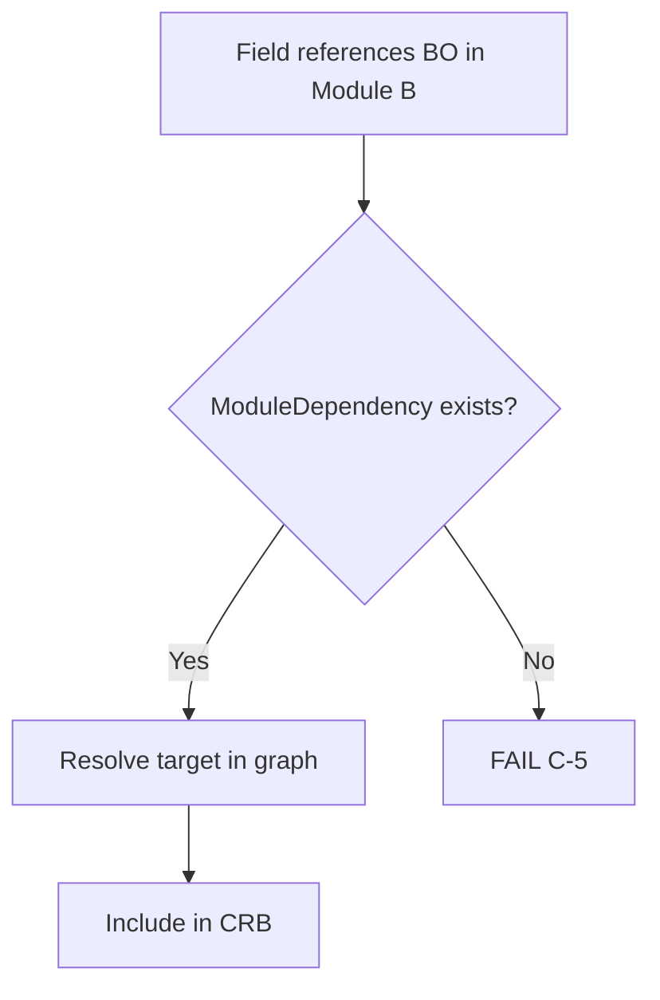
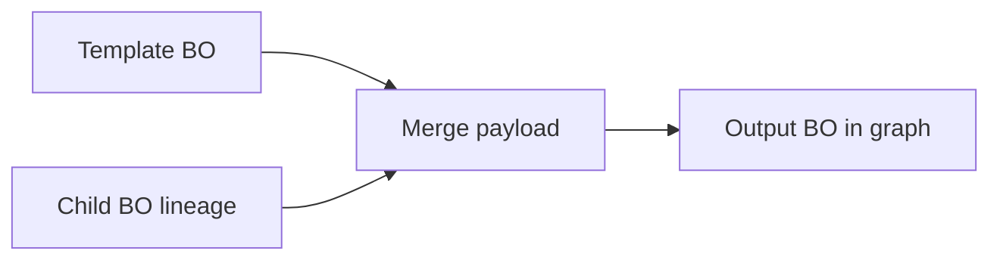

# 04 — Object Dependencies

> **Status:** Official SSOT · Program 4.01.1  
> **Owner topic:** Dependency kinds and resolution rules  
> **Related:** [15-MODULES.md](./15-MODULES.md) · [17-PUBLISH-PIPELINE.md](./17-PUBLISH-PIPELINE.md) · [RULES.md](./RULES.md)

---

## Objetivo

Formalizar as **cinco relações de dependência** entre objetos MMM e as regras de resolução no compile e runtime.

---

## Escopo

| In scope | Out of scope |
|----------|--------------|
| possess, use, reference, depend, inherit | SQL foreign keys (L0) |
| ModuleDependency | Network topology |
| Compile-time resolution | Runtime lazy loading order |

---

## Responsabilidades

| Component | Responsibility |
|-----------|----------------|
| Author | Declare explicit dependencies |
| Publish Engine (C-2, C-5) | Resolve and validate |
| Runtime | Consume resolved graph in CRB |
| Studio | Visualize dependency graph |

---

## Conceitos

| Kind | Semantics | Example |
|------|-----------|---------|
| **possess** | Containment (parent owns children) | Module possess BusinessObjects |
| **use** | Runtime consumption (no ownership) | Screen uses Layout |
| **reference** | Loose link (may be cross-module) | Field references FieldOption |
| **depend** | Hard compile dependency | Module depend ModuleDependency |
| **inherit** | Composition with lineage (not OOP) | BusinessObject inherit template BO |

---

## Modelo

### Dependency declaration

Each MMM object may declare:

```typescript
dependencies: {
  possess?: ObjectRef[]      // owned children IDs
  use?: ObjectRef[]          // consumed refs
  reference?: ObjectRef[]    // soft refs
  depend?: ObjectRef[]       // hard deps (compile fail if missing)
  inherit?: LineageRef[]     // template + version lineage
}
```

### ModuleDependency (required for cross-module)

```typescript
ModuleDependency {
  objectType: "module_dependency"
  sourceModuleRef: objectId
  targetModuleRef: objectId
  dependencyType: "hard" | "soft"
  exportedRefs?: objectId[]  // explicit exports
}
```

### Resolution order (compile)

1. Collect scope objects (C-1)
2. Expand `possess` trees inward
3. Resolve `reference` and `use` (materialize targets)
4. Validate `depend` (including ModuleDependency for cross-module)
5. Apply `inherit` (merge template payload with lineage)
6. Detect cycles in `depend` graph → fail C-5

---

## Regras

| ID | Rule |
|----|------|
| R-11 | Cross-module `reference`/`depend` requires ModuleDependency |
| R-15 | `inherit` is composition + lineage, not class extension |
| R-05 | Resolved refs use stable objectId across versions |

---

## Fluxos

### Cross-module reference validation



### Inherit composition



---

## Diagramas

Ver fluxos acima e hierarquia em [01-CORE-ARCHITECTURE.md](./01-CORE-ARCHITECTURE.md).

---

## Exemplos

**Module A → Module B:**

- Module A Screen references Module B BusinessObject
- Requires `module_dependency` A→B with `dependencyType: hard`
- Publish C-5 validates; CRB includes both modules or explicit export list

**BusinessObject inherit template:**

- Child BO declares `inherit: [{ objectId: templateBoId, version: "1.0" }]`
- Compile merges fields from template; child overrides win
- Lineage records template provenance

---

## Restrições

- Circular `depend` → publish blocked.
- `possess` does not cross tenant boundary.
- Deleted/archived targets → resolve fails unless optional ref flagged.

---

## Integrações

| Phase | Dependency check |
|-------|-------------------|
| C-2 Resolve | Materialize all refs |
| C-5 Validate Dependency | Module graph acyclic |
| Studio Designer | Dependency visualization |
| Marketplace | Package manifest lists depend |

---

## Versionamento

Dependency schema: `mmm-dependency-v1`. New dependency kinds additive only.

---

## Próximos passos

- Program 4.02: dependency JSON Schema
- Program 4.08: Studio dependency graph UI
- Gate G405: circular dependency detection test

---

*End of document.*
