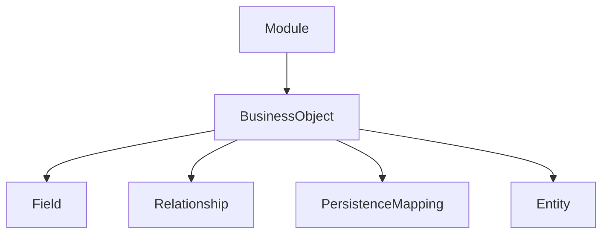
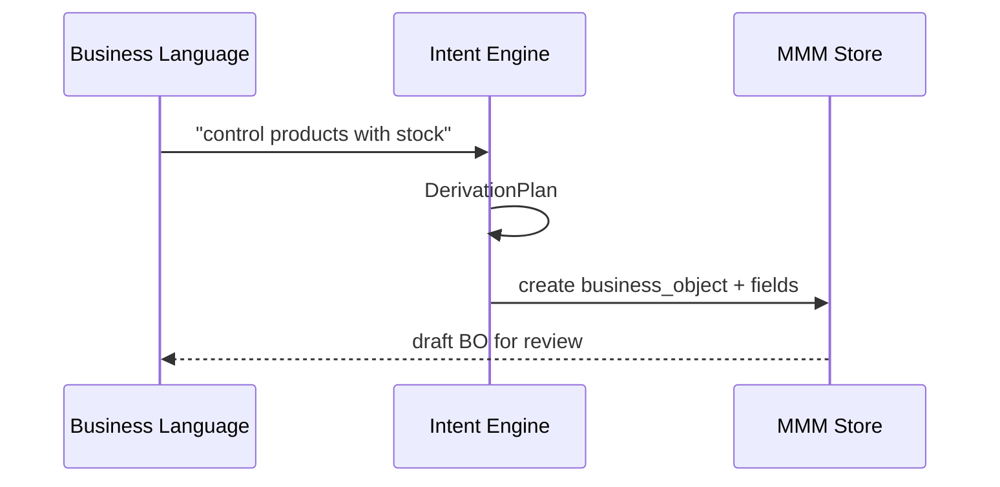

# 05 — Business Objects

> **Status:** Official SSOT · Program 4.01.1  
> **Owner topic:** BusinessObject and Entity definitions  
> **Related:** [06-FIELDS.md](./06-FIELDS.md) · [07-RELATIONSHIPS.md](./07-RELATIONSHIPS.md) · [23-GENERIC-REPOSITORY.md](./23-GENERIC-REPOSITORY.md)

---

## Objetivo

Definir **BusinessObject** como unidade central de modelagem de domínio no MMM — separando definição (MMM) de instância (Record L0).

---

## Escopo

| In scope | Out of scope |
|----------|--------------|
| `business_object`, `business_object_version`, `entity`, `entity_kind` | Prisma model codegen |
| BO metadata envelope | UI rendering |
| Persistence mapping ref | Adapter implementation |

---

## Responsabilidades

| Layer | Responsibility |
|-------|----------------|
| Author | Define BO, fields, relationships |
| Publish Engine | Validate BO ≥1 field (semantic) |
| Generic Repository | Persist Records per PersistenceMapping |
| Runtime | Render via CRB field registry |

---

## Conceitos

- **BusinessObject** — logical domain entity (e.g. Product, Customer).
- **Entity** — physical persistence view of a BO (may be 1:1 or split).
- **Entity Kind** — classification (master, transaction, reference, config).
- **Record** — L0 data row; **not** an MMM object (R-14).

---

## Modelo

### BusinessObject (payload summary)

| Attribute | Type | Required | Description |
|-----------|------|----------|-------------|
| `objectId` | string | ✓ | Stable ID |
| `objectType` | `"business_object"` | ✓ | Taxonomy |
| `code` | string | ✓ | Unique per module |
| `entityKindRef` | objectId | ✓ | master / transaction / etc. |
| `persistenceMappingRef` | objectId | ✓ | See [24-PERSISTENCE.md](./24-PERSISTENCE.md) |
| `fieldRefs` | objectId[] | ✓ (≥1) | Owned fields |
| `relationshipRefs` | objectId[] | | Outgoing relationships |
| `primaryKeyFieldRef` | objectId | ✓ | Identity field |
| `displayFieldRef` | objectId | | Label for lookups |
| `auditEnabled` | boolean | | Default true |
| `softDeleteEnabled` | boolean | | Default true |
| `multiCompany` | boolean | | companyId scope |
| `labels` | LabelSet[] | ✓ | i18n |

### Hierarchy

---

## Regras

- R-14: Record ≠ MMM object.
- Semantic validation: BO must have ≥1 field before publish.
- `code` unique within owning Module scope.
- Inherit via composition ([04-OBJECT-DEPENDENCIES.md](./04-OBJECT-DEPENDENCIES.md)).

---

## Fluxos

### BO creation via Business Language

---

## Diagramas

Ver hierarquia acima.

---

## Exemplos

**Product BO:**

- `code: "product"`
- Fields: sku, name, minStock, unitPrice
- `persistenceMappingRef`: EAV adapter
- Screen + Grid compiled into CRB

---

## Restrições

- No BO without PersistenceMapping (compile semantic fail).
- Cross-module BO reference requires ModuleDependency.
- Legacy cadastro modules migrate to BO objects (Program 4.14).

---

## Integrações

| Subsystem | Integration |
|-----------|-------------|
| Generic Repository | Record CRUD |
| Studio Entity Designer | BO authoring (4.08) |
| Marketplace | BO export in .makpkg |
| Intelligence | Usage metrics on BO |

---

## Versionamento

`business_object_version` tracks payload changes; CRB pins DefinitionVersion.

---

## Próximos passos

- Program 4.02: BO PlatformSchema
- Program 4.06: EAV persistence for dynamic BO
- Program 4.08: Entity Designer

---

*End of document.*
