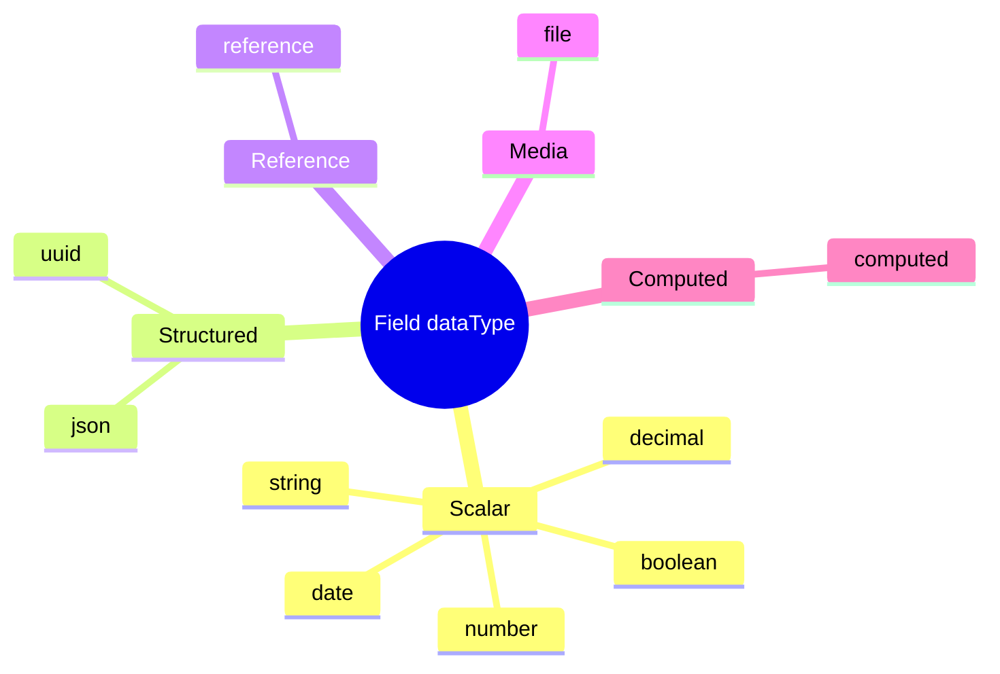

# 06 — Fields

> **Status:** Official SSOT · Program 4.01.1  
> **Owner topic:** Field, FieldOption, FieldGroup definitions  
> **Related:** [05-BUSINESS-OBJECTS.md](./05-BUSINESS-OBJECTS.md) · [08-PRESENTATION-LAYER.md](./08-PRESENTATION-LAYER.md)

---

## Objetivo

Especificar o modelo **Field** completo — tipos, validação, formatação, indexação e mapeamento para persistência e UI.

---

## Escopo

| In scope | Out of scope |
|----------|--------------|
| `field`, `field_option`, `field_group` | Formula engine implementation |
| Field types catalog | Mask regex engine code |
| Validation refs | Custom renderer React code |

---

## Responsabilidades

| Component | Responsibility |
|-----------|----------------|
| Author | Define fields on BO |
| Publish Engine | Compile to field registry (V14) |
| Runtime | Render + validate per CRB |
| Generic Repository | Map to EAV/JSONB/column |

---

## Conceitos

- **Field** — atomic data definition on a BusinessObject.
- **FieldOption** — enum/select choices.
- **FieldGroup** — visual/logical grouping for forms.

---

## Modelo

### Field attributes

| Attribute | Type | Description |
|-----------|------|-------------|
| `code` | string | Unique within BO |
| `dataType` | enum | string, number, boolean, date, datetime, decimal, uuid, json, reference, file, computed |
| `required` | boolean | Validation |
| `unique` | boolean | Constraint |
| `indexed` | boolean | EAV index / DB index |
| `searchable` | boolean | Full-text participation |
| `defaultValue` | any | Default on create |
| `fieldOptionRefs` | objectId[] | For enum/select |
| `referenceBoRef` | objectId | For lookup/reference type |
| `validationRefs` | objectId[] | Validation rules |
| `formulaRef` | objectId | Computed fields |
| `formatterRef` | objectId | Display format |
| `maskRef` | objectId | Input mask |
| `permissionRef` | objectId | Field-level security |
| `persistenceColumn` | string | For prisma_model mapping |
| `jsonPath` | string | For jsonb_column mapping |
| `labels` | LabelSet[] | i18n |
| `helpTextRef` | objectId | Help content |

### Data types

---

## Regras

- Field `code` unique within owning BO.
- `reference` type requires `referenceBoRef`.
- `computed` requires `formulaRef`; not writable at runtime.
- Field permissions enforced via CRB ([13-PERMISSIONS.md](./13-PERMISSIONS.md)).

---

## Fluxos

### Field compile path

---

## Diagramas

Ver mindmap acima.

---

## Exemplos

**minStock field:**

- `dataType: number`, `required: true`, `defaultValue: 0`
- Validation: `>= 0`
- Formatter: integer display

---

## Restrições

- Cannot delete field with existing Record data without migration plan (governance).
- Indexed fields limited per tenant plan (PlatformPolicy).

---

## Integrações

| Registry | Engine |
|----------|--------|
| V14 Field | Foundation field engine |
| V16 Validation | Validation engine |
| V17 Formula | Formula engine |
| EAV | Generic Repository |

---

## Versionamento

Field changes create new BO version; CRB tracks field registry hash.

---

## Próximos passos

- Program 4.02: Field JSON Schema per dataType
- Program 4.08: Field designer in Studio

---

*End of document.*
