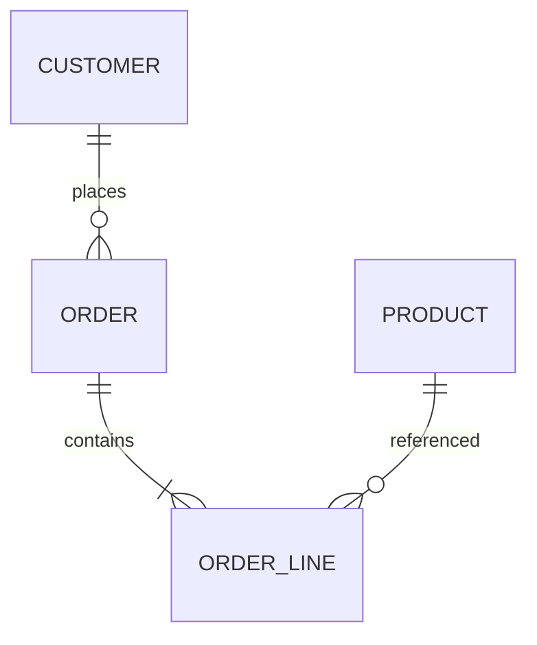
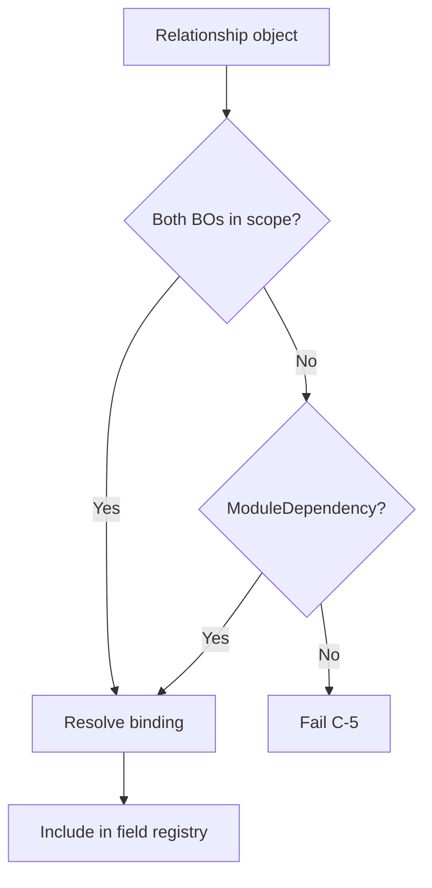

# 07 — Relationships

> **Status:** Official SSOT · Program 4.01.1  
> **Owner topic:** Relationship and RelationshipBinding  
> **Related:** [05-BUSINESS-OBJECTS.md](./05-BUSINESS-OBJECTS.md) · [04-OBJECT-DEPENDENCIES.md](./04-OBJECT-DEPENDENCIES.md)

---

## Objetivo

Definir **relacionamentos** entre BusinessObjects — cardinalidade, integridade, navegação e binding de persistência.

---

## Escopo

| In scope | Out of scope |
|----------|--------------|
| `relationship`, `relationship_binding` | GraphQL schema |
| Cardinality | ORM code generation |
| Cross-module refs | Social graph |

---

## Responsabilidades

| Component | Responsibility |
|-----------|----------------|
| Author | Declare relationships |
| Publish Engine | Validate FK semantics |
| Generic Repository | Enforce referential integrity |
| Runtime | Navigate related records in UI |

---

## Conceitos

- **Relationship** — logical link between two BOs.
- **RelationshipBinding** — how link persists (column, junction, EAV ref).

---

## Modelo

### Relationship

| Attribute | Values |
|-----------|--------|
| `sourceBoRef` | objectId |
| `targetBoRef` | objectId |
| `cardinality` | 1:1, 1:N, N:1, N:N |
| `navName` | string (code) |
| `inverseNavName` | string (optional) |
| `onDelete` | restrict, cascade, setNull |
| `required` | boolean |
| `bindingRef` | objectId |

### Cardinality

---

## Regras

- Cross-module relationship requires ModuleDependency (R-11).
- N:N requires junction binding or EAV link table.
- `onDelete: cascade` blocked for cross-tenant targets.

---

## Fluxos

### Relationship resolution at compile

---

## Diagramas

Ver ER diagram acima.

---

## Exemplos

**Customer → Orders (1:N):**

- `sourceBoRef: customer`, `targetBoRef: order`
- Binding: `order.customerId` column

---

## Restrições

- Self-referential relationships allowed with depth limit (PlatformPolicy).
- Broken target BO → publish fail.

---

## Integrações

Generic Repository, Studio Entity Designer, CRB field registry.

---

## Versionamento

Relationship changes version with source BO.

---

## Próximos passos

- Program 4.02: relationship schema
- Program 4.06: junction table adapter

---

*End of document.*
