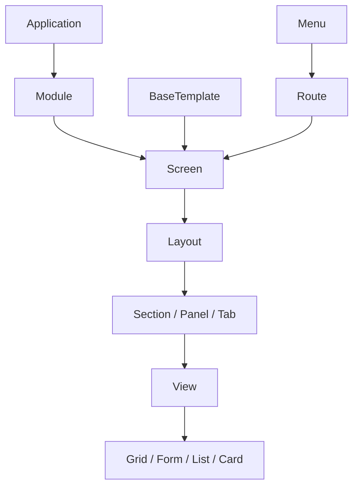
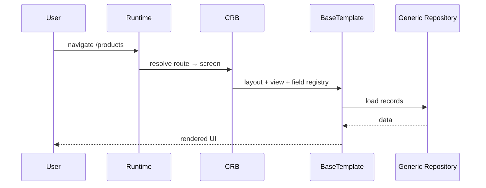

# 08 — Presentation Layer

> **Status:** Official SSOT · Program 4.01.1  
> **Owner topic:** Screens, layouts, views, templates, design tokens  
> **Related:** [05-BUSINESS-OBJECTS.md](./05-BUSINESS-OBJECTS.md) · [18-COMPILED-RUNTIME-BUNDLE.md](./18-COMPILED-RUNTIME-BUNDLE.md) · [DECISIONS.md](./DECISIONS.md) D-MMM-05

---

## Objetivo

Documentar a camada de **apresentação declarativa** — como telas, layouts e templates MMM compilam para experiência BOS/Web/Mobile sem código React manual.

---

## Escopo

| In scope | Out of scope |
|----------|--------------|
| Grupo D objectTypes (35) | React component source |
| BaseTemplate, Screen, Layout, View | CSS-in-JS implementation |
| Route, Menu, Theme | Browser APIs |

---

## Responsabilidades

| Component | Responsibility |
|-----------|----------------|
| Author | Define screens bound to BO |
| Publish Engine | C-10 routes, C-12 templates |
| BaseTemplate engine | Render from CRB |
| Runtime Bridge | Inject registries V13–V20 |

---

## Conceitos

- **BaseTemplate** — pluggable rendering engine (`modelobase1` = first).
- **Screen** — routable UI surface for a BO or dashboard.
- **Layout** — structure (sections, panels, tabs).
- **View** — data presentation mode (form, grid, kanban, etc.).

---

## Modelo

### Presentation hierarchy

### Key objectTypes (Grupo D)

`base_template`, `screen`, `page`, `layout`, `section`, `panel`, `tab`, `view`, `form`, `grid`, `list`, `card`, `detail`, `theme`, `design_token`, `route`, `menu`, `menu_item`, `action`, `button`, `client_target`

### Screen binding

| Attribute | Description |
|-----------|-------------|
| `targetBoRef` | Primary BusinessObject |
| `layoutRef` | Layout tree |
| `defaultViewRef` | Initial view |
| `toolbarRefs` | Actions |
| `permissionRef` | Screen access |
| `clientTargets` | web, mobile, embedded |

---

## Regras

- R-01: Visible UI derives from published Screen objects.
- R-04: Business users author via Business Language, not raw Screen JSON (Expert Mode exception).
- D-MMM-05: Multi-template via BaseTemplate objects.
- No duplicate route paths (C-10 validation).

---

## Fluxos

### Screen render pipeline

---

## Diagramas

Ver hierarquia e sequence acima.

---

## Exemplos

**Product list screen:**

- Screen → Layout → Section → Grid view
- Grid columns from Field refs
- Toolbar: Create, Export actions

---

## Restrições

- Foundation V10 engines frozen — new view types via registry extension only.
- `client_target` mismatch → screen excluded from that client CRB slice.

---

## Integrações

| Registry | Content |
|----------|---------|
| layout (V13) | Layout configs |
| route | Route table |
| menu | Menu tree |
| baseTemplate | Template entries |

---

## Versionamento

Screen changes follow module DefinitionVersion; CRB contentHash detects drift.

---

## Próximos passos

- Program 4.08: Screen designer
- Program 4.05: Universal Runtime Bridge for all modules

---

*End of document.*
