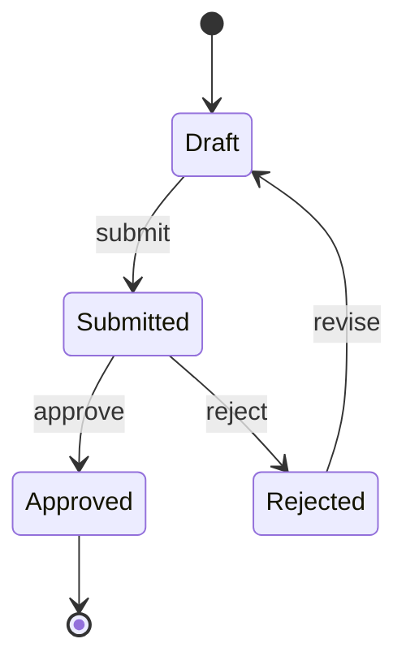
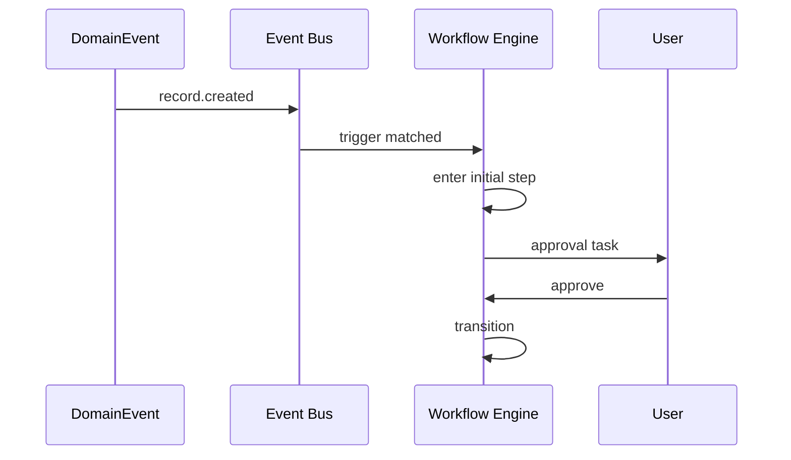

# 09 — Workflows

> **Status:** Official SSOT · Program 4.01.1  
> **Owner topic:** Workflow, steps, transitions, triggers  
> **Related:** [10-AUTOMATIONS.md](./10-AUTOMATIONS.md) · [25-EVENT-BUS.md](./25-EVENT-BUS.md)

---

## Objetivo

Definir **workflows** como objetos MMM que orquestram processos de negócio com estados, transições e aprovações.

---

## Escopo

| In scope | Out of scope |
|----------|--------------|
| Grupo F workflow types | BPMN engine code |
| WorkflowTrigger | External Camunda |
| Approval steps | Email SMTP config |

---

## Responsabilidades

| Component | Responsibility |
|-----------|----------------|
| Author | Model workflow on BO |
| Publish Engine | Compile V20 workflow registry |
| Workflow Engine | Execute from CRB |
| Event Bus | Trigger via domain events |

---

## Conceitos

- **Workflow** — state machine for records or process instances.
- **WorkflowStep** — node (task, approval, gateway).
- **WorkflowTransition** — edge with conditions.
- **WorkflowTrigger** — subscribes to Event Bus.

---

## Modelo

### Workflow object

| Attribute | Description |
|-----------|-------------|
| `targetBoRef` | Record type |
| `initialStepRef` | Required (semantic validation) |
| `stepRefs` | WorkflowStep[] |
| `transitionRefs` | WorkflowTransition[] |
| `triggerRefs` | Event subscriptions |

---

## Regras

- Semantic: workflow must have `initialStepRef` (C-4).
- R-20: critical approval steps require human action.
- Workflow permissions via [13-PERMISSIONS.md](./13-PERMISSIONS.md).

---

## Fluxos

---

## Diagramas

Ver state diagram acima.

---

## Exemplos

Purchase order approval: Draft → Submitted → Manager Approval → Approved.

---

## Restrições

- Cannot bind workflow to BO without publish scope inclusion.
- Parallel gateways require `parallel_block` objects.

---

## Integrações

Event Bus L3, V20 workflow registry, Studio Workflow Designer (4.09).

---

## Versionamento

Active workflow instances pin to DefinitionVersion at start.

---

## Próximos passos

- Program 4.09: Workflow designer
- Program 4.11: Event Bus triggers

---

*End of document.*
