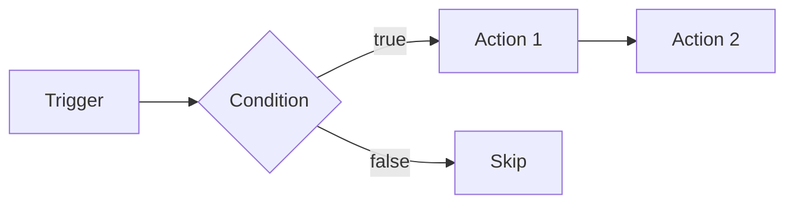
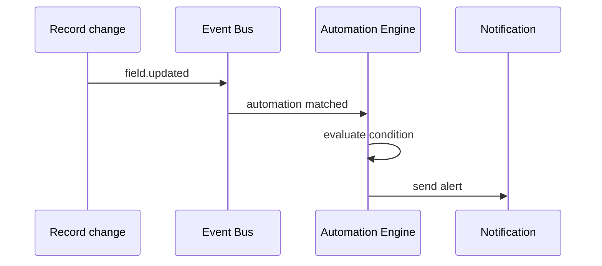

# 10 — Automations

> **Status:** Official SSOT · Program 4.01.1  
> **Owner topic:** Automation, triggers, action chains, schedules  
> **Related:** [09-WORKFLOWS.md](./09-WORKFLOWS.md) · [25-EVENT-BUS.md](./25-EVENT-BUS.md) · [RULES.md](./RULES.md) R-20

---

## Objetivo

Especificar **automações** declarativas — reações a eventos, schedules e condições sem código imperativo.

---

## Escopo

| In scope | Out of scope |
|----------|--------------|
| `automation`, `trigger`, `schedule`, `action_chain` | Cron daemon implementation |
| `parallel_block`, `branch_block`, `loop_block` | Arbitrary script execution |
| Process nodes/edges | |

---

## Responsabilidades

| Component | Responsibility |
|-----------|----------------|
| Author | Define automation rules |
| Publish Engine | Compile to action registry (V19) |
| Automation Engine | Execute at runtime |
| Event Bus | Deliver triggers |

---

## Conceitos

- **Automation** — reactive or scheduled behavior.
- **Trigger** — event or time condition.
- **ActionChain** — ordered actions (notify, update field, call API).

---

## Modelo

### Automation types

| Type | Trigger source |
|------|----------------|
| Event-driven | DomainEvent via Event Bus |
| Scheduled | Schedule object (cron) |
| Record change | Field change event |
| Manual | Action button |

---

## Regras

- R-20: Critical automations (financial, delete, publish) require human approval gate.
- R-01: Automation must be MMM-published to execute.
- No automation writes MMM objects (Intelligence rule R-12 applies to Intelligence only; automations affect L0 Records).

---

## Fluxos

---

## Diagramas

Ver flowchart acima.

---

## Exemplos

**Low stock alert:**

- Trigger: `record.updated` on Product where minStock > quantity
- Action: notify purchaser role

---

## Restrições

- `script` objects sandboxed; no filesystem/network without connector permission.
- Loop blocks require `timeout_policy`.

---

## Integrações

V19 action registry, V18 event registry, Webhook dispatch.

---

## Versionamento

Automation changes require republish; running instances use pinned CRB.

---

## Próximos passos

- Program 4.09: Automation designer
- Gate **G436**: critical automation approval tests

---

*End of document.*
