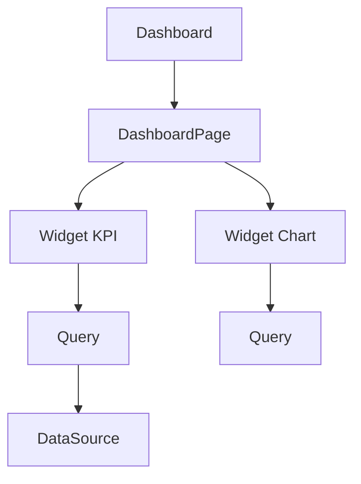
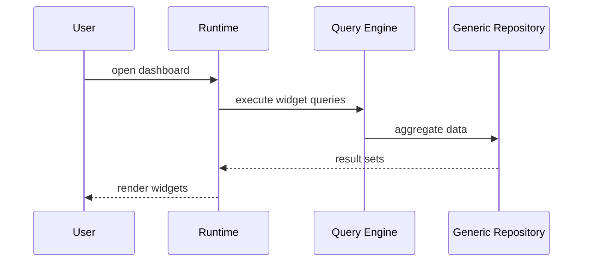

# 11 — Dashboards

> **Status:** Official SSOT · Program 4.01.1  
> **Owner topic:** Dashboard, widget, KPI, chart objects  
> **Related:** [12-REPORTS.md](./12-REPORTS.md) · [08-PRESENTATION-LAYER.md](./08-PRESENTATION-LAYER.md)

---

## Objetivo

Documentar **dashboards analíticos** como objetos MMM — composição de widgets, queries e refresh policies.

---

## Escopo

| In scope | Out of scope |
|----------|--------------|
| Grupo E analytics (subset: dashboard, widget, kpi, chart) | Chart.js internals |
| DashboardPage, RefreshPolicy | Data warehouse ETL |
| Drill-down refs | |

---

## Responsabilidades

| Component | Responsibility |
|-----------|----------------|
| Author | Compose dashboards |
| Query engine | Execute Query objects |
| Runtime | Render from CRB |
| Intelligence | Recommend dashboard layouts (read-only) |

---

## Conceitos

- **Dashboard** — container of widgets with layout grid.
- **Widget** — visual unit (KPI, chart, pivot, indicator).
- **Query** — data source definition for widget.
- **RefreshPolicy** — polling/stream interval.

---

## Modelo

### Widget types

| Type | objectType |
|------|------------|
| KPI | `kpi` |
| Chart | `chart` |
| Indicator | `indicator` |
| Pivot | `pivot_table` |
| Table | embedded grid view |

---

## Regras

- Widget queries respect permission conditions (row-level security).
- Dashboard permission via [13-PERMISSIONS.md](./13-PERMISSIONS.md).
- Query must reference in-scope BO or approved DataSource.

---

## Fluxos

---

## Diagramas

Ver flowchart acima.

---

## Exemplos

Executive dashboard: revenue KPI, sales by region chart, top products pivot.

---

## Restrições

- Cross-tenant data forbidden in queries.
- Heavy queries subject to PlatformPolicy rate limits.

---

## Integrações

Studio Dashboard Designer (4.09), CRB analytics section, Intelligence observations.

---

## Versionamento

Dashboard versions with module; widgets can be shared via Marketplace templates.

---

## Próximos passos

- Program 4.09: Dashboard designer
- Program 4.07: Dashboard-level permissions

---

*End of document.*
