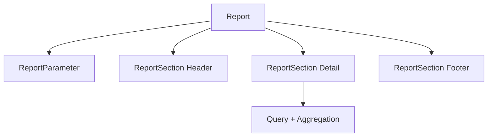
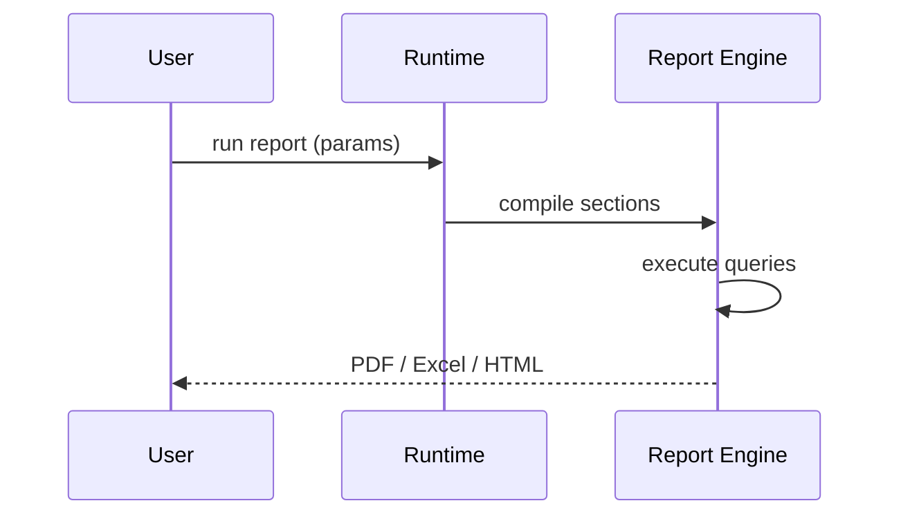

# 12 — Reports

> **Status:** Official SSOT · Program 4.01.1  
> **Owner topic:** Report, report section, parameters, export  
> **Related:** [11-DASHBOARDS.md](./11-DASHBOARDS.md) · [Grupo E in 02-OBJECT-TAXONOMY.md](./02-OBJECT-TAXONOMY.md)

---

## Objetivo

Definir **relatórios** estruturados — parametrizados, seccionados e exportáveis — como objetos MMM distintos de dashboards interativos.

---

## Escopo

| In scope | Out of scope |
|----------|--------------|
| `report`, `report_section`, `report_parameter` | PDF engine code |
| Query, aggregation, rollup | Printer drivers |
| Export formats declaration | |

---

## Responsabilidades

| Component | Responsibility |
|-----------|----------------|
| Author | Define report layout and queries |
| Report Engine | Render at runtime |
| Publish Engine | Include in CRB |
| Marketplace | Share report templates |

---

## Conceitos

- **Report** — batch-oriented document output.
- **ReportSection** — band (header, detail, footer, group).
- **ReportParameter** — user input at run time (date range, company).

---

## Modelo

---

## Regras

- Report parameters typed and validated before execution.
- Same permission model as dashboards.
- Scheduled reports use Schedule + Automation objects.

---

## Fluxos

---

## Diagramas

Ver flowchart acima.

---

## Exemplos

Monthly sales report: parameter `month`, sections by region, export PDF.

---

## Restrições

- Large reports async via job queue (Platform Core).
- PII fields masked per field permission.

---

## Integrações

Query engine, Automation (scheduled delivery), Document templates.

---

## Versionamento

Report templates versioned; historical runs store parameter snapshot.

---

## Próximos passos

- Program 4.09: Report designer
- Program 4.02: report object schemas

---

*End of document.*
