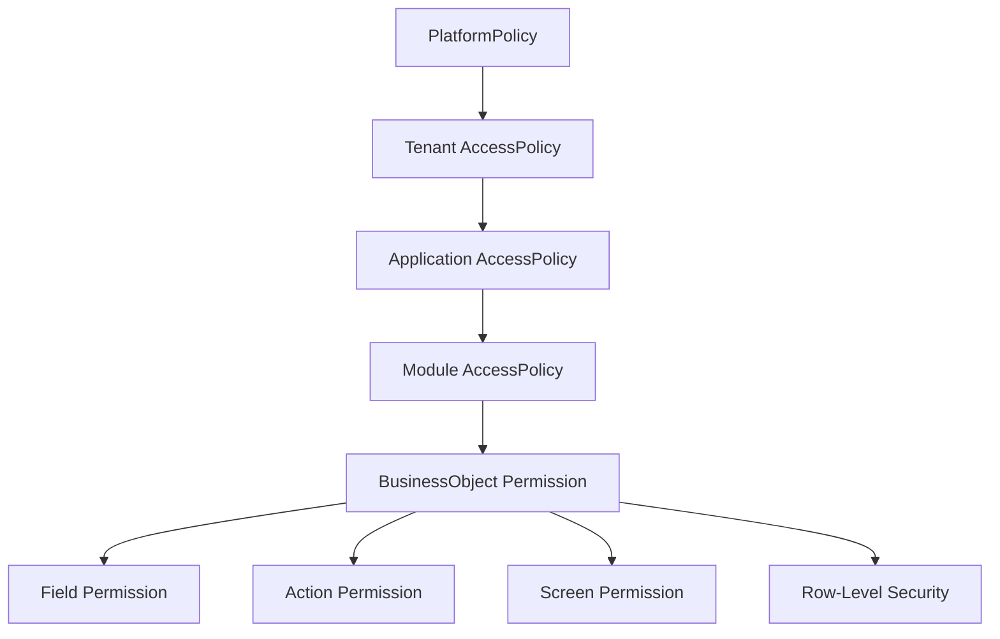
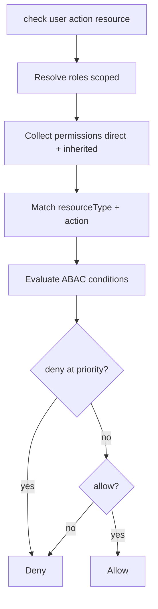

# 13 — Permissions

> **Status:** Official SSOT · Program 4.01.1  
> **Owner topic:** Permission, Role, AccessPolicy model  
> **Related:** [RULES.md](./RULES.md) R-10 · [18-COMPILED-RUNTIME-BUNDLE.md](./18-COMPILED-RUNTIME-BUNDLE.md) · [DECISIONS.md](./DECISIONS.md) D-MMM-07

---

## Objetivo

Documentar o modelo de **autorização enterprise** — Permission e Role como objetos MMM com enforcement via CRB (substituindo RBAC fixo de 3 perfis).

---

## Escopo

| In scope | Out of scope |
|----------|--------------|
| Permission, Role, AccessPolicy hierarchy | OAuth provider config |
| Field/action/screen/API/RLS permissions | JWT implementation |
| Runtime check algorithm | |

---

## Responsabilidades

| Component | Responsibility |
|-----------|----------------|
| Author | Define roles and permissions |
| Publish Engine | C-11 compile permission registry |
| Runtime | Fail-closed check on every action |
| PlatformPolicy | Global limits |

---

## Conceitos

- **Permission** — allow/deny on resource + action + optional condition (ABAC).
- **Role** — bundle of permissions with scope (platform/tenant/company/OU).
- **AccessPolicy** — container at tenant/application/module level.

---

## Modelo

### Hierarchy

### Permission object

| Field | Values |
|-------|--------|
| `resourceType` | business_object, field, screen, action, api, dashboard, workflow, module, application |
| `resourceRef` | objectId |
| `action` | create, read, update, delete, execute, admin, publish, install |
| `condition` | ConditionRef (ABAC) |
| `effect` | allow, deny |
| `priority` | int (deny wins at same priority) |

### Role object

| Field | Description |
|-------|-------------|
| `scope` | platform, tenant, company, OU |
| `scopeRef` | tenantId / companyId / ouId |
| `inheritsFromRef` | role inheritance |
| `permissionRefs` | Permission objectIds |
| `isSystem` | seed ADMIN/OPERADOR/CONSULTA |

---

## Regras

- R-10: Permission is MMM object; enforced via CRB.
- Default: **deny** (fail-closed).
- Deny overrides allow at same priority.
- C-6: no permission orphan, no cross-tenant ref.

---

## Fluxos

### Runtime check

---

## Diagramas

Ver hierarchy e flowchart acima.

---

## Exemplos

Field `salary` hidden for CONSULTA role; RLS `ownerId = currentUser()` on opportunities.

---

## Restrições

- `publish` and `install` require explicit permission (not implied by admin).
- Cross-tenant permission refs blocked at compile.

---

## Integrações

CRB `permission` registry, UsuarioPerfil migration to Role seeds (4.07), Studio Permission Designer.

---

## Versionamento

Permission changes require republish; active sessions revalidate on CRB pin update.

---

## Próximos passos

- Program 4.07: Permission model implementation
- Program 4.02: permission JSON Schema

---

*End of document.*
