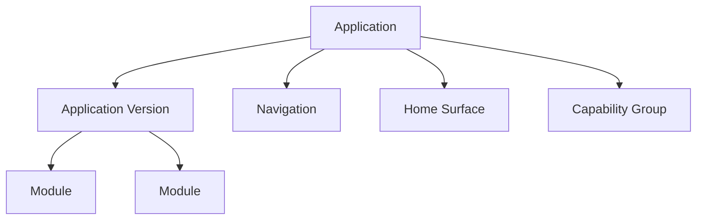
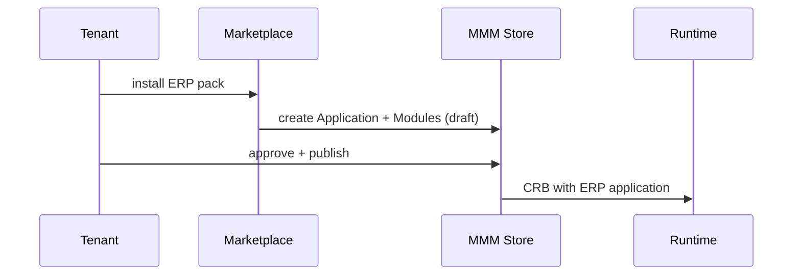

# 14 — Applications

> **Status:** Official SSOT · Program 4.01.1  
> **Owner topic:** Application topology and ERP-as-Application  
> **Related:** [15-MODULES.md](./15-MODULES.md) · [DECISIONS.md](./DECISIONS.md) D-MMM-12

---

## Objetivo

Definir **Application** como container de topo de capacidades de negócio — incluindo a convergência **ERP = Application object**.

---

## Escopo

| In scope | Out of scope |
|----------|--------------|
| `application`, `application_version` | Deployment K8s manifests |
| Home surface, navigation root | DNS routing |
| Capability catalog binding | |

---

## Responsabilidades

| Component | Responsibility |
|-----------|----------------|
| Platform | Seed platform applications |
| Tenant admin | Enable/install applications |
| Author | Package application metadata |
| Marketplace | Distribute application .makpkg |

---

## Conceitos

- **Application** — bounded product (e.g. MAK ERP, CRM Pack).
- **Application Version** — semver snapshot of module set.
- **Home Surface** — default landing experience.

---

## Modelo

### Application attributes

| Attribute | Description |
|-----------|-------------|
| `code` | Unique identifier (e.g. `mak-erp`) |
| `moduleRefs` | Contained modules |
| `defaultLocaleRef` | i18n default |
| `brandingRef` | Tenant override allowed |
| `capabilityRefs` | BOS capability catalog |

---

## Regras

- D-MMM-12: ERP modules are Module objects under ERP Application.
- Application cannot reference modules without ModuleDependency graph acyclicity.
- Tenant plan may restrict available applications (PlatformPolicy).

---

## Fluxos

---

## Diagramas

Ver flowchart acima.

---

## Exemplos

`mak-erp` Application contains modules: financeiro, vendas, estoque (Program 4.16+).

---

## Restrições

- One active Application Version pin per environment slice (configurable).
- Application uninstall archives modules, does not hard-delete Records.

---

## Integrações

BOS capability catalog, Marketplace industry packs, Environment Pin.

---

## Versionamento

`application_version` semver; breaking changes require major bump.

---

## Próximos passos

- Program 4.16: ERP as Application packages
- Program 4.12: Application .makpkg format

---

*End of document.*
