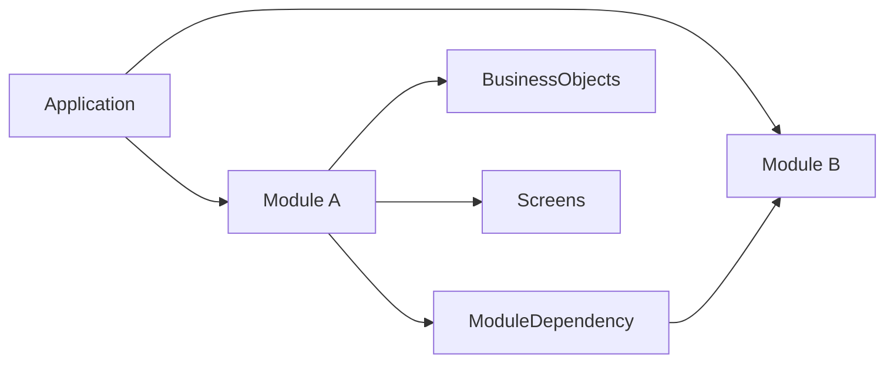
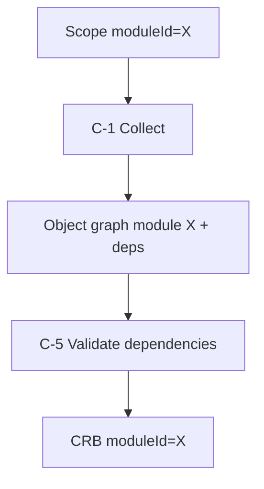

# 15 — Modules

> **Status:** Official SSOT · Program 4.01.1  
> **Owner topic:** Module, ModuleVersion, ModuleDependency  
> **Related:** [14-APPLICATIONS.md](./14-APPLICATIONS.md) · [04-OBJECT-DEPENDENCIES.md](./04-OBJECT-DEPENDENCIES.md)

---

## Objetivo

Especificar **Module** como unidade de composição funcional — agrupando BusinessObjects, Screens, Workflows e dependências explícitas.

---

## Escopo

| In scope | Out of scope |
|----------|--------------|
| `module`, `module_version`, `module_dependency` | npm package structure |
| Feature, route roots | Git repo layout |
| Publish scope boundary | |

---

## Responsabilidades

| Component | Responsibility |
|-----------|----------------|
| Author | Define module boundary |
| Publish Engine | Scope filter by moduleId |
| Runtime | Load module slice from CRB |
| Gates | Module certification (G4xx) |

---

## Conceitos

- **Module** — cohesive feature package within Application.
- **ModuleDependency** — explicit cross-module contract (R-11).
- **Module Version** — immutable snapshot reference.

---

## Modelo

### Module attributes

| Attribute | Description |
|-----------|-------------|
| `code` | Unique within application |
| `applicationRef` | Parent application |
| `businessObjectRefs` | Owned BOs |
| `screenRefs` | Owned screens |
| `dependencyRefs` | ModuleDependency objects |
| `featureRefs` | Feature flags |

---

## Regras

- R-11: Cross-module reference requires ModuleDependency.
- Publish scope can be module-scoped or application-wide.
- Module `code` stable across versions (objectId stable per R-05).

---

## Fluxos

### Module-scoped publish

---

## Diagramas

Ver flowchart acima.

---

## Exemplos

Module `empresas` (legacy cadastro) migrates to MMM module with BO + screens.

---

## Restrições

- Circular module dependencies forbidden.
- Module cannot be published without ≥1 routable screen or API (semantic warning).

---

## Integrações

CRB `moduleId` field, Studio module navigator, Generator output target.

---

## Versionamento

`module_version` linked to DefinitionVersion.

---

## Próximos passos

- Program 4.14: Legacy module elimination
- Program 4.15: First zero-code module

---

*End of document.*
