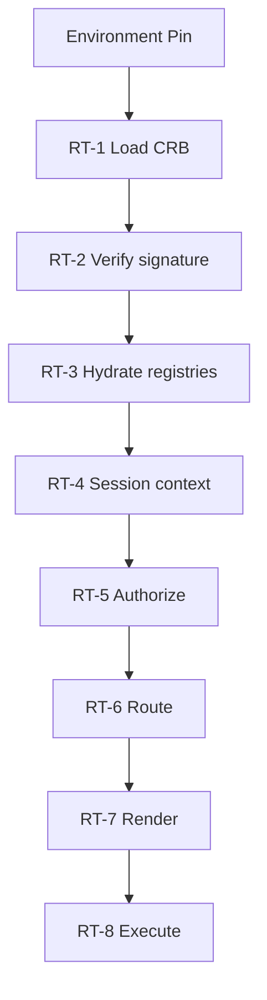
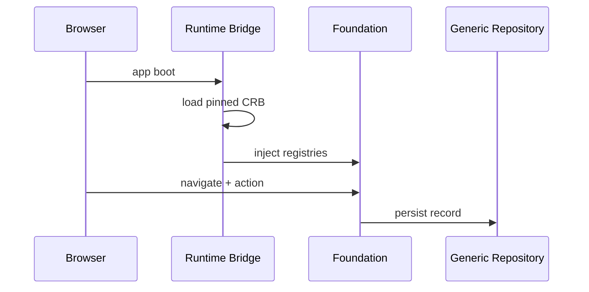

# 16 — Runtime

> **Status:** Official SSOT · Program 4.01.1  
> **Owner topic:** Runtime consumption pipeline (CRB-only)  
> **Related:** [18-COMPILED-RUNTIME-BUNDLE.md](./18-COMPILED-RUNTIME-BUNDLE.md) · [DECISIONS.md](./DECISIONS.md) D-MMM-04 · [CONTRACTS.md](./CONTRACTS.md) C-01

---

## Objetivo

Documentar como o **Runtime** consome exclusivamente CRB para executar experiência, persistência e automação — pipeline de 8 fases.

---

## Escopo

| In scope | Out of scope |
|----------|--------------|
| 8-phase consumption pipeline | Foundation engine source code |
| Runtime Bridge | Browser bundle optimization |
| Client targets (web, mobile, IoT) | |

---

## Responsabilidades

| Component | Responsibility |
|-----------|----------------|
| Runtime Bridge | CRB → engine registries |
| Foundation V10 | Execute frozen engines (D-MMM-13) |
| BaseTemplate | Render UI |
| Generic Repository | L0 data access |

---

## Conceitos

- **Runtime Bridge** — adapter loading CRB into Foundation maps.
- **Environment Pin** — active CRB pointer per environment.
- **Boot cache** — legacy; **not SSOT** (R-02, D-MMM-04).

---

## Modelo

### 8-phase consumption pipeline

| Phase | Name | Input | Output |
|-------|------|-------|--------|
| RT-1 | **Load Pin** | EnvironmentPin | CRB reference |
| RT-2 | **Verify CRB** | CRB + signature | Trust decision |
| RT-3 | **Hydrate Registries** | CRB.registries | V13–V20 maps in memory |
| RT-4 | **Resolve Session** | User + tenant + company | Auth context |
| RT-5 | **Authorize** | Permission registry | Allow/deny |
| RT-6 | **Route** | Route table | Screen selection |
| RT-7 | **Render** | BaseTemplate + layout | UI |
| RT-8 | **Execute** | Actions, workflows, automations | Side effects |

---

## Regras

- R-02: Runtime consumes CRB only, never raw MMM metadata.
- R-01: All visible behavior from published CRB.
- R-16: Foundation executes, never defines.
- D-MMM-13: Foundation V10 frozen.

---

## Fluxos

---

## Diagramas

Ver pipeline flowchart acima.

---

## Exemplos

Empresas module (pilot): CRB → Runtime Bridge → ModeloBase1 grid.

---

## Restrições

- No runtime fetch of draft MMM objects.
- CRB signature verification mandatory in production.
- Multi-client: filter by `clientTargets` in CRB.

---

## Integrações

Publish Engine output, BOS shell, Mobile shell, IoT embedded runtime.

---

## Versionamento

Runtime expects `crbVersion: mmm-crb-v1`; incompatible versions rejected.

---

## Próximos passos

- Program 4.05: Runtime Bridge v2 universal
- Program 4.14: Remove boot cache SSOT

---

*End of document.*
