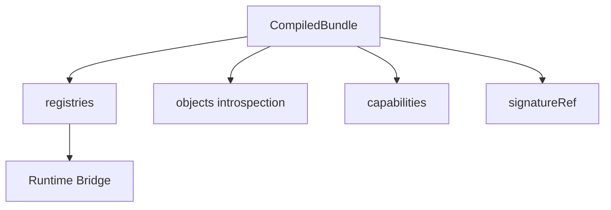

# 18 — Compiled Runtime Bundle (CRB)

> **Status:** Official SSOT · Program 4.01.1  
> **Owner topic:** CRB canonical structure  
> **Related:** [16-RUNTIME.md](./16-RUNTIME.md) · [17-PUBLISH-PIPELINE.md](./17-PUBLISH-PIPELINE.md) · [DECISIONS.md](./DECISIONS.md) D-MMM-04

---

## Objetivo

Definir a estrutura canônica do **Compiled Runtime Bundle (CRB)** — única entrada do Runtime.

---

## Escopo

| In scope | Out of scope |
|----------|--------------|
| CRB header, registries, objects copy | Compression algorithm |
| Engine version compatibility | Binary serialization format |
| Signature | |

---

## Responsabilidades

| Component | Responsibility |
|-----------|----------------|
| Publish Engine C-13 | Assemble CRB |
| Signer C-14 | Attach signatureRef |
| Runtime Bridge | Parse and hydrate |
| Environment Pin | Point to active CRB |

---

## Conceitos

- **CRB** — immutable compiled artifact (`compiled_bundle` objectType).
- **contentHash** — hash of normalized graph.
- **integrityHash** — includes registries + metadata.

---

## Modelo

```typescript
CompiledBundle {
  crbVersion: "mmm-crb-v1"
  bundleId: string
  definitionVersionId: string
  tenantId: string
  moduleId: string | "all"
  baseTemplateId: string
  contentHash: string          // SHA-256
  integrityHash: string
  compiledAt: datetime
  clientTargets: ClientTarget[]

  registries: {
    layout: Map<moduleId, LayoutConfig[]>       // V13
    field: Map<moduleId, FieldConfig[]>         // V14
    validation: Map<moduleId, ValidationConfig[]> // V16
    formula: Map<moduleId, FormulaConfig[]>     // V17
    event: Map<moduleId, EventConfig[]>         // V18
    action: Map<moduleId, ActionConfig[]>       // V19
    workflow: Map<moduleId, WorkflowConfig[]>   // V20
    permission: Map<resourceKey, Permission[]>
    route: RouteEntry[]
    menu: MenuTree
    baseTemplate: BaseTemplateEntry[]
  }

  objects: MMMEnvelope[]   // introspection copy

  capabilities: {
    engines: ["V13"..."V20"]
    views: string[]
    integrations: string[]
  }

  metadata: {
    objectCount: number
    fieldCount: number
    screenCount: number
    compiledBy: string
    sourceRevision: number
  }

  signatureRef: string
}
```



---

## Regras

- R-02: Runtime **only** consumes CRB.
- Boot cache may mirror CRB for performance but is not SSOT.
- Signature verification required in production (RT-2).

---

## Fluxos

See [16-RUNTIME.md](./16-RUNTIME.md) RT-1 through RT-3.

---

## Diagramas

Ver flowchart acima.

---

## Exemplos

`empresas` pilot CRB: single moduleId, modelobase1 baseTemplate, V13–V20 registries populated.

---

## Restrições

- CRB immutable after C-14 sign; corrections require new publish.
- `crbVersion` mismatch → Runtime rejects load.

---

## Integrações

Runtime Bridge, Foundation engines, CDN cache (C-16 invalidation).

---

## Versionamento

`mmm-crb-v1` current; future versions additive fields only.

---

## Próximos passos

- Program 4.04: CRB assembler
- Program 4.05: Universal CRB consumption

---

*End of document.*
