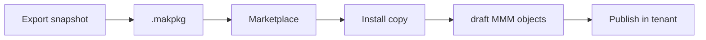
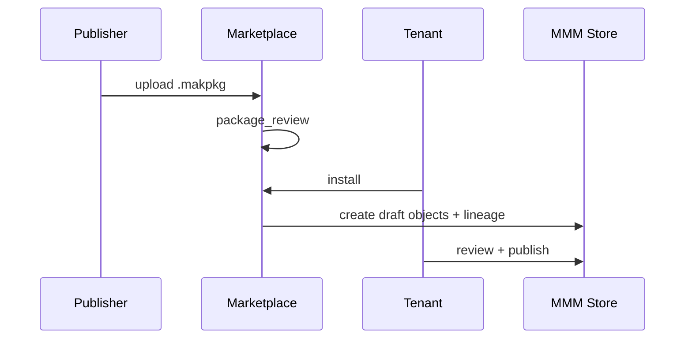

# 19 — Marketplace

> **Status:** Official SSOT · Program 4.01.1  
> **Owner topic:** .makpkg distribution and install flow  
> **Related:** [DECISIONS.md](./DECISIONS.md) D-MMM-11 · [RULES.md](./RULES.md) R-18 · [27-VERSIONING.md](./27-VERSIONING.md)

---

## Objetivo

Documentar o **Marketplace** — publicação, distribuição e instalação de pacotes MMM (`.makpkg`) em 12 granularidades.

---

## Escopo

| In scope | Out of scope |
|----------|--------------|
| Package, manifest, license, review | Payment gateway |
| 12 publish granularities | App store UI polish |
| Install with lineage | |

---

## Responsabilidades

| Component | Responsibility |
|-----------|----------------|
| Publisher | Export .makpkg from snapshot |
| Marketplace | Host, review, catalog |
| Tenant | Install copy with lineage |
| Publish Engine | Re-publish after install review |

---

## Conceitos

- **.makpkg** — signed archive of MMM snapshot + manifest.
- **Package Manifest** — dependencies, version, object counts.
- **Lineage** — install creates new objectIds, preserves source provenance.

---

## Modelo

### 12 granularities

| # | Granularity | Contents |
|---|-------------|----------|
| 1 | Platform pack | Platform-level templates |
| 2 | Industry pack | Vertical BO + screens |
| 3 | Application | Full application |
| 4 | Module | Single module |
| 5 | BusinessObject | BO + fields |
| 6 | Screen template | Screen + layout |
| 7 | Dashboard template | Dashboard + widgets |
| 8 | Workflow template | Workflow definition |
| 9 | Report template | Report definition |
| 10 | Integration pack | Connectors + APIs |
| 11 | Theme pack | Theme + design tokens |
| 12 | Business Language pack | Terms + intent templates |

---

## Regras

- R-18: Install = copy with lineage, never in-place mutation.
- R-07: Lineage records marketplace source package.
- R-11: Manifest lists ModuleDependency for cross-module packs.

---

## Fluxos

---

## Diagramas

Ver flowchart acima.

---

## Exemplos

Install "Retail Industry Pack" → creates draft modules, BOs, screens → tenant customizes → publish.

---

## Restrições

- No cross-tenant objectId reuse.
- License object enforced before install (`package_license`).

---

## Integrações

Publish snapshots, Package review workflow, BOS marketplace surface.

---

## Versionamento

`package_version` semver; installed copy tracks `lineage.sourceVersion`.

---

## Próximos passos

- Program 4.12: Marketplace v1 + .makpkg spec
- Program 4.02: package manifest schema

---

*End of document.*
