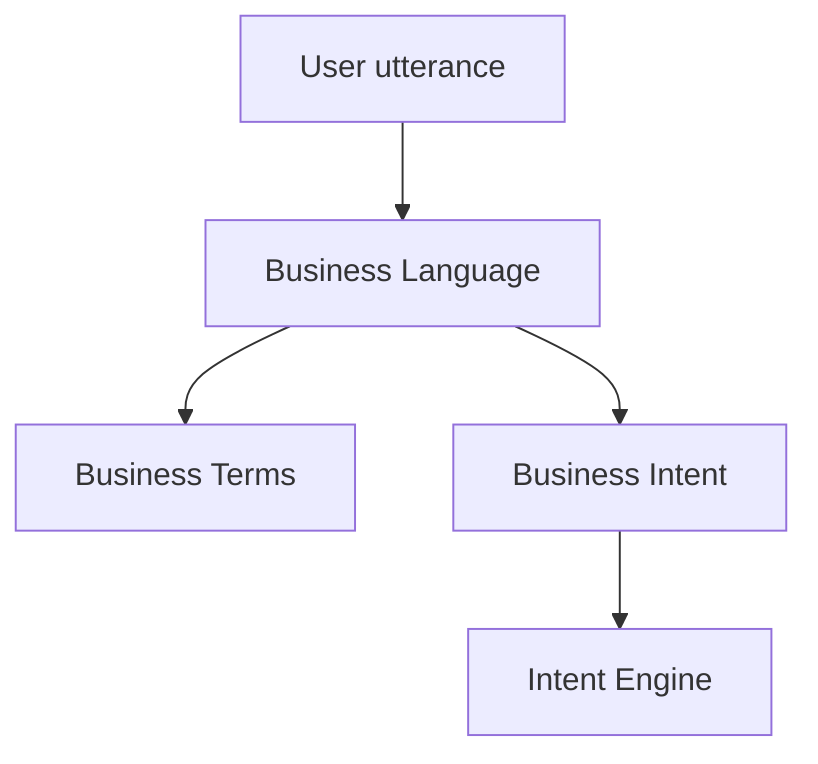
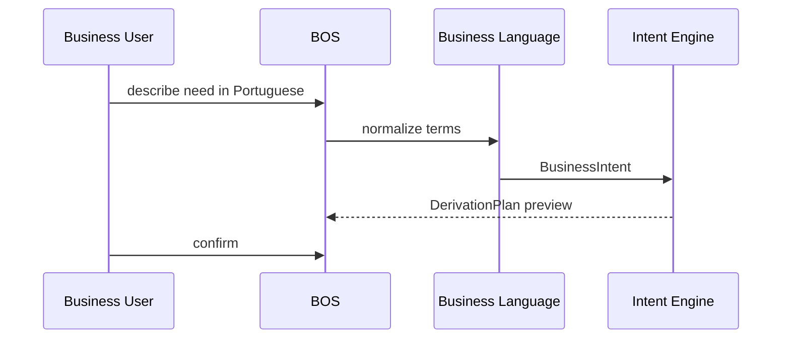

# 20 — Business Language

> **Status:** Official SSOT · Program 4.01.1  
> **Owner topic:** Natural language authoring gateway  
> **Related:** [21-INTENT-ENGINE.md](./21-INTENT-ENGINE.md) · [DECISIONS.md](./DECISIONS.md) D-MMM-08 · [RULES.md](./RULES.md) R-04

---

## Objetivo

Definir **Business Language** como gateway de autoria para usuários de negócio — humano ou IA — nunca código.

---

## Escopo

| In scope | Out of scope |
|----------|--------------|
| Business terms, synonyms, vocabulary | NLP model training |
| Authoring pipeline entry | Programming language syntax |
| Grupo I authoring types (subset) | |

---

## Responsabilidades

| Component | Responsibility |
|-----------|----------------|
| BOS | Primary authoring surface (D-074, D-MMM-14) |
| Business Language layer | Parse and normalize utterances |
| Intent Engine | Downstream resolution |
| Studio | Expert Mode exception for raw MMM edit |

---

## Conceitos

- **Business Term** — canonical vocabulary entry.
- **Business Synonym** — alias mapping to term.
- **Business Language** — structured utterance in domain vocabulary.

---

## Modelo

### ObjectTypes (Grupo I subset)

`business_language`, `business_term`, `business_synonym`, `business_asset`, `business_rule`, `business_process`, `business_objective`

### Vocabulary rules

| Rule | Description |
|------|-------------|
| Terms tenant-scoped | Optional platform seed |
| Synonyms resolve to single term | Disambiguation UI if ambiguous |
| Unsupported term | Prompt to extend catalog |

---

## Regras

- R-04: Business Language is gateway for business users.
- D-MMM-08: Single authoring path → Intent → MMM.
- R-03: AI output enters as AICandidate, not direct MMM.

---

## Fluxos

---

## Diagramas

Ver flowchart acima.

---

## Exemplos

"Preciso controlar produtos com estoque mínimo e alertar o comprador" → Intent → Product BO + minStock field + automation.

---

## Restrições

- No code blocks in Business Language channel.
- Expert Mode Studio bypass logged for audit.

---

## Integrações

Intent Engine, AI Gateway (AICandidate), BOS wizards (Program 4.10).

---

## Versionamento

Business term catalog versioned per tenant; platform seed terms immutable IDs.

---

## Próximos passos

- Program 4.10: Business Language wizards
- Program 4.02: business_term schema

---

*End of document.*
