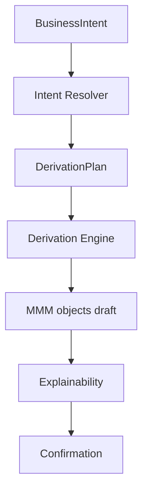

# 21 — Intent Engine

> **Status:** Official SSOT · Program 4.01.1  
> **Owner topic:** Intent resolution and derivation  
> **Related:** [20-BUSINESS-LANGUAGE.md](./20-BUSINESS-LANGUAGE.md) · [22-AI-GATEWAY.md](./22-AI-GATEWAY.md) · [DECISIONS.md](./DECISIONS.md) D-MMM-08

---

## Objetivo

Especificar o **Intent Engine** — resolução de BusinessIntent, DerivationPlan e materialização de objetos MMM.

---

## Escopo

| In scope | Out of scope |
|----------|--------------|
| Intent Resolver, Derivation Engine | LLM provider APIs |
| 19 derivation kinds | Custom codegen |
| Explainability, confirmation | |

---

## Responsabilidades

| Component | Responsibility |
|-----------|----------------|
| Intent Resolver | Map intent → derivation plan |
| Derivation Engine | Plan → MMM object graph |
| Human reviewer | Confirm before publish |
| Explainability | Business-language summary |

---

## Conceitos

- **BusinessIntent** — structured goal from Business Language.
- **DerivationPlan** — ordered list of derivation steps.
- **Derivation** — single transform producing MMM objects.

---

## Modelo

### Pipeline

### 19 derivation kinds

| # | Kind | Produces |
|---|------|----------|
| 1 | `create_business_object` | business_object + entity |
| 2 | `add_field` | field |
| 3 | `add_relationship` | relationship |
| 4 | `create_screen` | screen + layout + view |
| 5 | `create_workflow` | workflow + steps |
| 6 | `create_automation` | automation + triggers |
| 7 | `create_dashboard` | dashboard + widgets |
| 8 | `create_report` | report + sections |
| 9 | `create_api` | api + endpoints |
| 10 | `add_validation` | validation rules |
| 11 | `add_formula` | formula + computed field |
| 12 | `add_permission` | permission + role binding |
| 13 | `create_module` | module |
| 14 | `create_application` | application |
| 15 | `add_integration` | connector + mapping |
| 16 | `extend_template` | inherit BO/screen |
| 17 | `create_menu_route` | route + menu_item |
| 18 | `add_notification` | notification + action |
| 19 | `package_export` | package manifest prep |

---

## Regras

- D-MMM-08: Intent → Derivation → MMM is sole authoring path for business users.
- Output objects always enter lifecycle at `draft` or `review`.
- Derivation cannot call `publish` directly.

---

## Fluxos

See pipeline diagram above and [03-OBJECT-LIFECYCLE.md](./03-OBJECT-LIFECYCLE.md).

---

## Diagramas

Ver pipeline flowchart acima.

---

## Exemplos

Intent "stock control" → derivations 1, 2, 6, 18 → Product BO, minStock field, automation, notification.

---

## Restrições

- Ambiguous intent → clarification dialog, not guess-and-publish.
- Cross-module derivations require explicit module target in plan.

---

## Integrações

AI Gateway (AICandidate input), Studio (plan preview), Publish Engine (after confirmation).

---

## Versionamento

`intent_template` and `derivation_plan` objects versioned; catalog extensible additively.

---

## Próximos passos

- Program 4.10: Business Language wizards
- Program 4.13: AI-assisted derivation

---

*End of document.*
