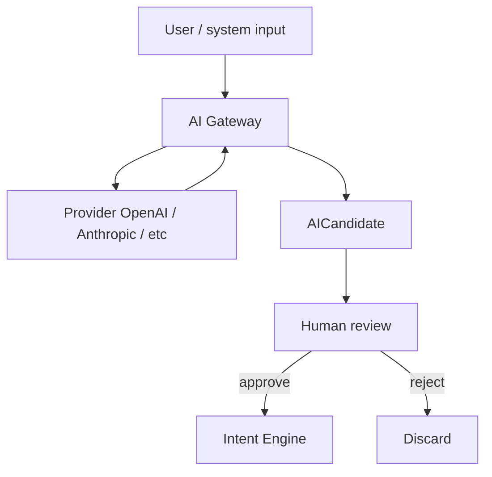
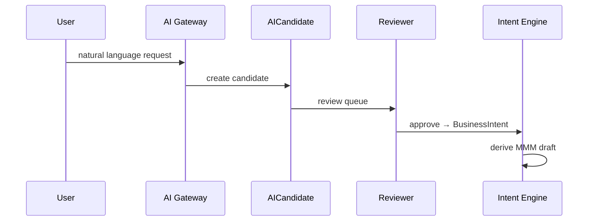

# 22 — AI Gateway

> **Status:** Official SSOT · Program 4.01.1  
> **Owner topic:** Provider-agnostic AI → AICandidate pipeline  
> **Related:** [21-INTENT-ENGINE.md](./21-INTENT-ENGINE.md) · [DECISIONS.md](./DECISIONS.md) D-MMM-09 · [RULES.md](./RULES.md) R-03

---

## Objetivo

Documentar o **AI Gateway** — camada provider-agnostic que produz **AICandidate** para revisão humana, nunca código ou publish direto.

---

## Escopo

| In scope | Out of scope |
|----------|--------------|
| AICandidate, ai_prompt, ai_context | Model fine-tuning |
| Provider abstraction | Prompt injection attacks (see governance) |
| Grupo K AI types (subset) | |

---

## Responsabilidades

| Component | Responsibility |
|-----------|----------------|
| AI Gateway | Route to providers, normalize output |
| AICandidate | Staging artifact for review |
| Intent Engine | Consume approved candidates |
| Governance | D-074 compliance enforcement |

---

## Conceitos

- **AICandidate** — proposed Intent or MMM fragment awaiting review.
- **AI Context** — scoped context (tenant, module, BO) for prompts.
- **AI Prompt** — template with governance guardrails.

---

## Modelo

### AICandidate envelope

| Field | Description |
|-------|-------------|
| `candidateType` | intent, derivation_plan, mmm_object_draft |
| `confidence` | 0–1 score |
| `explainabilityRef` | Business-language rationale |
| `proposedPayload` | Structured JSON (not code) |
| `sourcePromptRef` | Audit trail |

---

## Regras

- R-03: AI → AICandidate → Intent; never code or publish.
- D-MMM-09: Compliance with D-074.
- R-12: Intelligence subsystem separate — observational only.
- R-20: Critical proposals require explicit human approval.

---

## Fluxos

---

## Diagramas

Ver flowcharts acima.

---

## Exemplos

AI suggests "add CPF field to Customer" → AICandidate with `add_field` derivation → human confirms.

---

## Restrições

- Providers must not receive cross-tenant data without policy consent.
- No AICandidate auto-publish threshold in v1.

---

## Integrações

Business Language, Intent Engine, Intelligence (observations only), Audit Log.

---

## Versionamento

AI Gateway API version independent of MMM; AICandidate schema in PlatformSchema.

---

## Próximos passos

- Program 4.13: AI Gateway + AICandidate implementation
- Governance: AI data handling policy

---

*End of document.*
