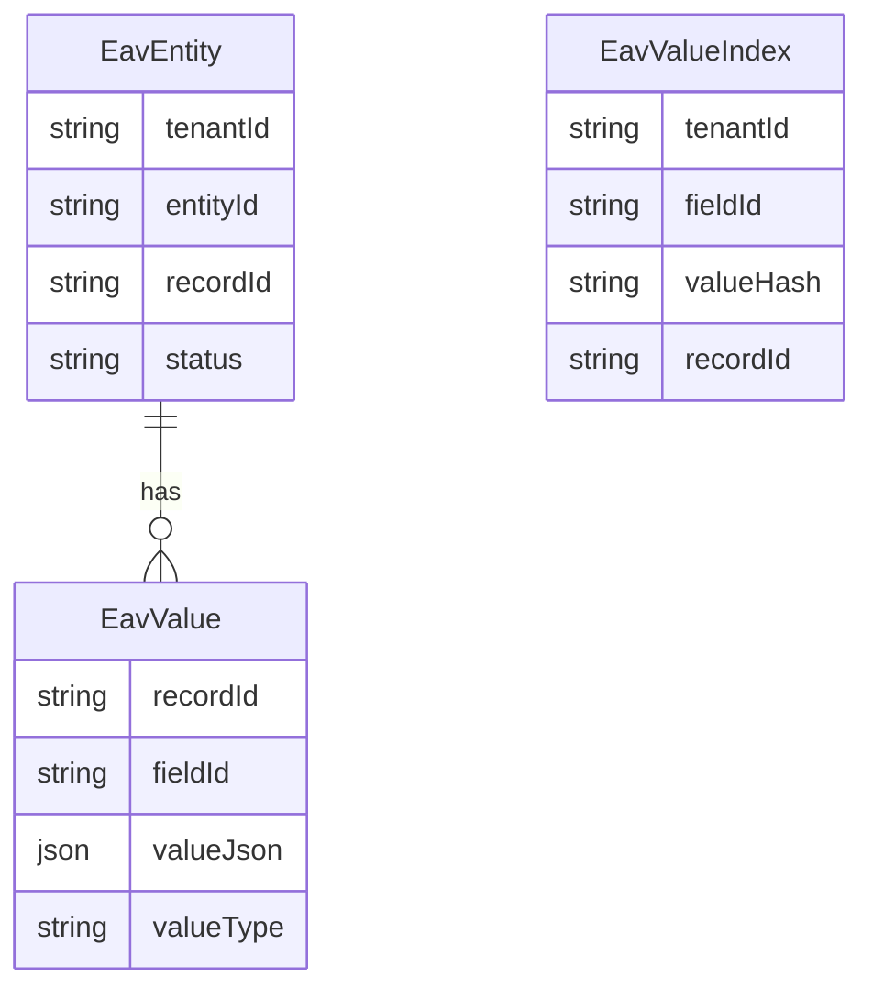
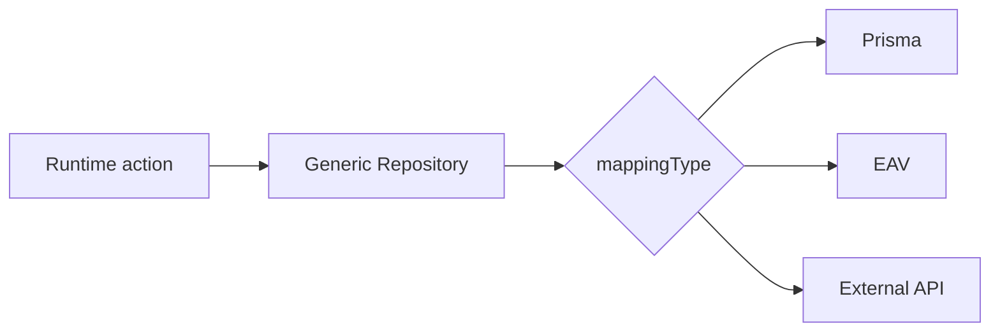

# 23 — Generic Repository

> **Status:** Official SSOT · Program 4.01.1  
> **Owner topic:** L0 persistence adapters and EAV  
> **Related:** [24-PERSISTENCE.md](./24-PERSISTENCE.md) · [05-BUSINESS-OBJECTS.md](./05-BUSINESS-OBJECTS.md) · [DECISIONS.md](./DECISIONS.md) D-MMM-06

---

## Objetivo

Documentar o **Generic Repository** — seleção de adapter por PersistenceMapping para Records L0.

---

## Escopo

| In scope | Out of scope |
|----------|--------------|
| 8 mapping adapters | Prisma schema migration scripts |
| EAV schema | Query optimizer internals |
| Runtime adapter selection | |

---

## Responsabilidades

| Component | Responsibility |
|-----------|----------------|
| MMM PersistenceMapping | Declares mappingType |
| Generic Repository | Route CRUD to adapter |
| Runtime | Invoke on RT-8 execute |
| Adapters | Implement storage semantics |

---

## Conceitos

- **Record** — L0 instance (not MMM object, R-14).
- **PersistenceMapping** — links BO to storage strategy.
- **Adapter** — pluggable persistence backend.

---

## Modelo

### Adapter catalog

| mappingType | Adapter | Use case | Scale |
|-------------|---------|----------|-------|
| `prisma_model` | GenericPrismaAdapter | Fixed schema (transition: Empresa) | High |
| `jsonb_column` | GenericJsonbAdapter | Custom fields in JSONB | Medium |
| `eav_table` | GenericEavAdapter | Fully dynamic entities | High |
| `generic_record` | CadastroRegistroAdapter | Multi-entity generic | High |
| `external_api` | ConnectorAdapter | External system | Varies |
| `iot_stream` | IoTStreamAdapter | Time-series telemetry | Very high |
| `virtual` | VirtualAdapter | Computed, not persisted | — |
| `file_storage` | ObjectStorageAdapter | Attachments | High |

### EAV schema

---

## Regras

- R-14: Records ≠ MMM objects.
- Adapter chosen at runtime from CRB PersistenceMapping ref.
- Tenant isolation enforced at adapter layer.

---

## Fluxos

---

## Diagramas

Ver ER diagram acima.

---

## Exemplos

Dynamic Product BO → `eav_table` → EavEntity + EavValue rows; searchable sku via EavValueIndex.

---

## Restrições

- `virtual` adapter read-only.
- Cross-adapter joins not supported in v1 (application-level).

---

## Integrações

PersistenceMapping MMM objects, Foundation record APIs, Event Bus (record events).

---

## Versionamento

Adapter interface versioned; new mappingTypes additive.

---

## Próximos passos

- Program 4.06: Generic Repository + EAV
- Program 4.15: Zero-code module on EAV

---

*End of document.*
