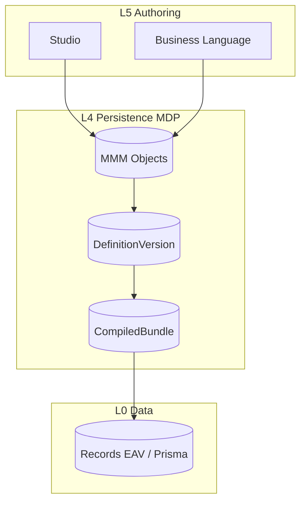

# 24 — Persistence

> **Status:** Official SSOT · Program 4.01.1  
> **Owner topic:** MDP as MMM persistence substrate  
> **Related:** [23-GENERIC-REPOSITORY.md](./23-GENERIC-REPOSITORY.md) · [26-PLATFORM-SCHEMA.md](./26-PLATFORM-SCHEMA.md) · [DECISIONS.md](./DECISIONS.md) D-MMM-01

---

## Objetivo

Descrever a evolução do **MDP (MAK Data Platform)** como substrato de persistência do MMM — expandindo taxonomia 26→222 objectTypes.

---

## Escopo

| In scope | Out of scope |
|----------|--------------|
| MMM table strategy | Legacy boot cache SSOT |
| MDP → MMM convergence | Full Prisma migration scripts |
| Tenant isolation | |

---

## Responsabilidades

| Layer | Responsibility |
|-------|----------------|
| MDP (L4) | Store MMM envelopes |
| PlatformSchema registry | Validate payloads |
| Publish Engine | Read published objects |
| Generic Repository | Store L0 Records |

---

## Conceitos

- **MDP** — persistence layer; evolves from parallel metadata system to MMM substrate.
- **MMM Envelope** — universal storage row format.
- **MdpRegistryEntryType** — legacy 26 types → superseded by 222 taxonomy.

---

## Modelo

### Envelope storage (conceptual)

| Column | Purpose |
|--------|---------|
| objectId | Stable identity |
| objectType | Taxonomy enum |
| tenantId | Isolation |
| status | Lifecycle |
| payload | JSON typed by PlatformSchema |
| lineage | Provenance JSON |
| labels | i18n JSON |

---

## Regras

- D-MMM-01: MMM is universal SSOT; MDP is substrate.
- R-05, R-06, R-07: Envelope invariants at persistence.
- Tenant isolation mandatory on all queries.

---

## Fluxos

See [17-PUBLISH-PIPELINE.md](./17-PUBLISH-PIPELINE.md) C-15 Persist.

---

## Diagramas

Ver architecture flowchart acima.

---

## Exemplos

Legacy `MdpRegistryEntry` for layout → migrates to `layout` objectType in MMM table.

---

## Restrições

- No dual-write to boot cache as SSOT (Program 4.14 elimination).
- Cross-tenant object access blocked at DB RLS.

---

## Integrações

Supersedes narrative in `docs/architecture/MAK-DATA-PLATFORM-ARCHITECTURE-SPECIFICATION.md` (see governance note).

---

## Versionamento

Schema migrations via Program 4.03; additive columns only where possible.

---

## Próximos passos

- Program 4.03: MMM Persistence tables
- Update legacy MDP doc with supersession pointer

---

*End of document.*
