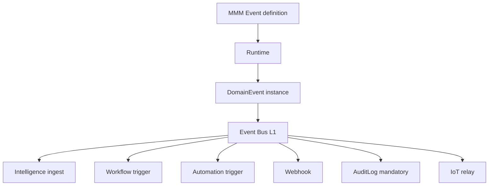

# 25 — Event Bus

> **Status:** Official SSOT · Program 4.01.1  
> **Owner topic:** Platform Event Bus L1 (Platform Core) vs MMM Event definitions  
> **Related:** [09-WORKFLOWS.md](./09-WORKFLOWS.md) · [10-AUTOMATIONS.md](./10-AUTOMATIONS.md) · [DECISIONS.md](./DECISIONS.md) D-MMM-10

---

## Objetivo

Separar **Event Bus L1** (Platform Core transport) de **Event objects MMM** (definitions) — incluindo integração Intelligence observacional.

---

## Escopo

| In scope | Out of scope |
|----------|--------------|
| DomainEvent instance format | Kafka/RabbitMQ vendor choice |
| MMM Event definition | Message broker HA setup |
| Subscriptions: workflow, automation, webhook, audit | |

---

## Responsabilidades

| Component | Responsibility |
|-----------|----------------|
| MMM Event object | Defines eventType schema |
| Runtime | Emits DomainEvent instances |
| Event Bus L1 | Transport and dispatch |
| Intelligence | Subscribe read-only (R-12) |

---

## Conceitos

- **Event (MMM)** — definition object in metadata.
- **DomainEvent** — runtime instance (not MMM).
- **Event Bus** — platform infrastructure (L1 Platform Core).

---

## Modelo

### DomainEvent

| Field | Type |
|-------|------|
| eventId | uuid |
| eventType | string (from MMM Event) |
| tenantId, companyId, userId | scope |
| sourceObjectType, sourceObjectId | ref |
| payload | JSON |
| timestamp | datetime |
| correlationId, causationId | tracing |

---

## Regras

- R-12: Intelligence observes, never writes MMM.
- AuditLog persist mandatory for all domain events.
- MMM defines **what** events exist; Bus **transports** them.

---

## Fluxos

See diagram above and [10-AUTOMATIONS.md](./10-AUTOMATIONS.md).

---

## Diagramas

Ver flowchart acima.

---

## Exemplos

`record.updated` on Product → Event Bus → low-stock automation + Intelligence observation.

---

## Restrições

- Cross-tenant event routing forbidden.
- Webhook dispatch requires connector permission.

---

## Integrações

Workflow triggers, Automation engine, Intelligence ingestion, IoT relay.

---

## Versionamento

Event Bus API L1 versioned separately from MMM Event schema.

---

## Próximos passos

- Program 4.11: Event Bus L1 Platform Core
- Program 4.02: Event object PlatformSchema

---

*End of document.*
