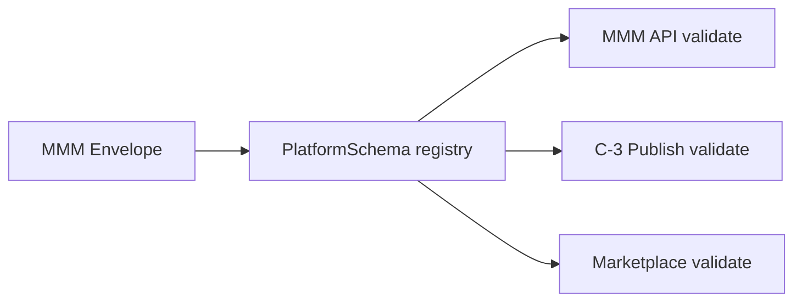

# 26 — Platform Schema

> **Status:** Official SSOT · Program 4.01.1  
> **Owner topic:** JSON Schema registry for 222 objectTypes  
> **Related:** [02-OBJECT-TAXONOMY.md](./02-OBJECT-TAXONOMY.md) · [17-PUBLISH-PIPELINE.md](./17-PUBLISH-PIPELINE.md) · [DECISIONS.md](./DECISIONS.md) D-MMM-03

---

## Objetivo

Definir **PlatformSchema** — registro canônico de JSON Schema por `objectType` para API, compile e marketplace.

---

## Escopo

| In scope | Out of scope |
|----------|--------------|
| `platform_schema` objectType | JSON Schema draft meta-spec |
| Envelope wrapper schema | Code generation from schema |
| Validation in C-3 | |

---

## Responsabilidades

| Component | Responsibility |
|-----------|----------------|
| Platform team | Maintain schema registry |
| Publish Engine C-3 | Validate each payload |
| MMM API | Reject invalid writes |
| Marketplace | Validate .makpkg contents |

---

## Conceitos

- **PlatformSchema** — JSON Schema document per objectType.
- **MMM Envelope** — universal wrapper; payload validated against PlatformSchema.
- **Schema version** — semver per objectType.

---

## Modelo

### Envelope + payload pattern (D-MMM-03)

| Layer | Validated by |
|-------|--------------|
| Envelope (objectId, type, status, labels, lineage) | Envelope schema |
| payload | objectType PlatformSchema |

---

## Regras

- D-MMM-03: Envelope universal + typed payload.
- R-19: New objectTypes additive; schemas deprecated not removed.
- Invalid payload → API 422, publish C-3 fail.

---

## Fluxos

Every MMM write: envelope parse → objectType lookup → JSON Schema validate → persist.

---

## Diagramas

Ver flowchart acima.

---

## Exemplos

`field` PlatformSchema requires `dataType` enum; publish rejects missing `labels`.

---

## Restrições

- Schemas published before objectType enabled in taxonomy.
- Breaking payload changes require new schema major version + migration path.

---

## Integrações

Program 4.02 primary deliverable; Gate **G421** schema coverage.

---

## Versionamento

Per-objectType semver; registry manifest `platform_schema` object.

---

## Próximos passos

- **Program 4.02:** Full PlatformSchema for 226 types + envelope
- Gate **G421**: schema coverage ≥100%

---

*End of document.*
