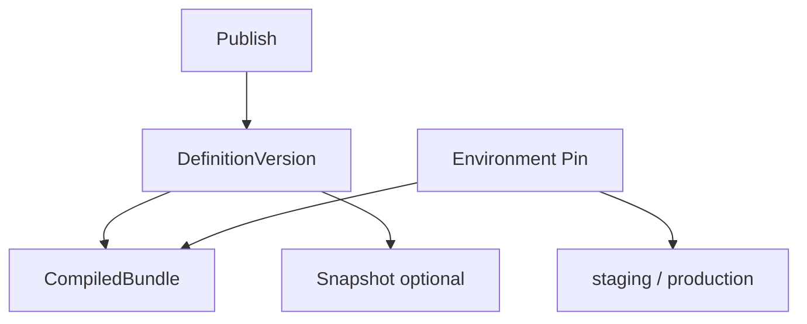
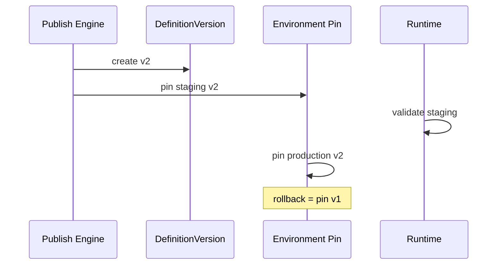

# 27 — Versioning

> **Status:** Official SSOT · Program 4.01.1  
> **Owner topic:** DefinitionVersion, snapshots, environment pins  
> **Related:** [03-OBJECT-LIFECYCLE.md](./03-OBJECT-LIFECYCLE.md) · [18-COMPILED-RUNTIME-BUNDLE.md](./18-COMPILED-RUNTIME-BUNDLE.md) · [RULES.md](./RULES.md) R-05, R-09

---

## Objetivo

Documentar estratégia de **versionamento** MMM — objectId estável, DefinitionVersion imutável, Environment Pin e rollback.

---

## Escopo

| In scope | Out of scope |
|----------|--------------|
| definition_version, snapshot, environment_pin | Git semver for app repo |
| package_version, application_version | npm package versions |
| Rollback via pin | |

---

## Responsabilidades

| Component | Responsibility |
|-----------|----------------|
| Publish Engine | Create DefinitionVersion + CRB |
| Environment Pin | Bind environment → CRB |
| Admin | Rollback pin |
| Marketplace | package_version semver |

---

## Conceitos

- **objectId** — stable across versions (R-05).
- **DefinitionVersion** — immutable publish boundary.
- **EnvironmentPin** — blue-green activation (R-09).
- **Snapshot** — optional full graph copy at publish time.

---

## Modelo

### Version objects (Grupo J)

`definition_version`, `compiled_bundle`, `snapshot`, `environment_pin`, `publish_log`, `package_version`, `application_version`, `module_version`, `business_object_version`, `business_asset_version`

---

## Regras

- R-05: objectId never changes on edit; new version tracked separately.
- R-09: Production requires EnvironmentPin.
- Rollback = pin prior DefinitionVersion, not mutate history.
- R-19: objectTypes deprecated, not deleted.

---

## Fluxos

---

## Diagramas

Ver flowcharts acima.

---

## Exemplos

Product BO field added → publish v3 → staging pin → prod pin; rollback pins v2 CRB.

---

## Restrições

- Concurrent publish same scope → optimistic lock on revision.
- Snapshot retention per tenant plan.

---

## Integrações

Publish pipeline C-15, Runtime RT-1, Marketplace package_version.

---

## Versionamento

This document: `mmm-versioning-v1`.

---

## Próximos passos

- Program 4.04: DefinitionVersion persistence
- Program 4.05: Pin management API

---

*End of document.*
