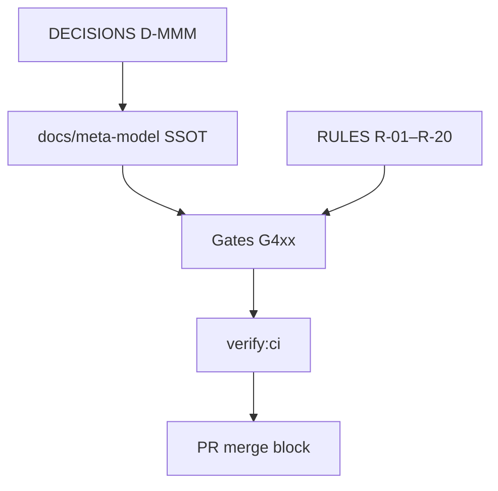

# 28 — Governance

> **Status:** Official SSOT · Program 4.01.1  
> **Owner topic:** MMM gates, certification, and platform governance  
> **Related:** [RULES.md](./RULES.md) · [DECISIONS.md](./DECISIONS.md) · [29-EXTENSION-POINTS.md](./29-EXTENSION-POINTS.md)

---

## Objetivo

Integrar o MMM ao **governance framework** MAK — gates G4xx, certificação de módulos e políticas de evolução.

---

## Escopo

| In scope | Out of scope |
|----------|--------------|
| MMM-specific gates | HR compliance |
| Governance policies as MMM objects | SOC2 audit execution |
| Constitution compliance | |

---

## Responsabilidades

| Component | Responsibility |
|-----------|----------------|
| Gates CI | Block invalid MMM states |
| Governance registry | Track programs 4.xx |
| Platform team | PlatformPolicy objects |
| Tenant admin | Tenant governance policies |

---

## Conceitos

- **Gate G4xx** — MMM certification family (new).
- **Governance Policy** — MMM object (Grupo K subset).
- **Constitution** — `docs/meta-model/` + platform constitution.

---

## Modelo

### Planned MMM gates (G420+ namespace)

> **Namespace rule:** Deploy gates **G401–G402** are reserved ([GATE-REGISTRY.md](../engineering/GATE-REGISTRY.md) D-062). MMM gates use **G420+** to avoid collision.

| Gate | Validates |
|------|-----------|
| G420 | MMM lifecycle transitions |
| G421 | PlatformSchema coverage (222 types) |
| G422 | Publish pipeline C-1→C-16 |
| G423 | Module dependency acyclicity |
| G424 | Critical automation approval |

---

## Regras

- No implementation may violate [RULES.md](./RULES.md).
- New objectTypes require gate schema update (R-19).
- D-MMM-15: `docs/meta-model/` is official MMM SSOT.

---

## Fluxos

PR → `npm run verify:ci` → G4xx + existing gates → merge if pass.

---

## Diagramas

Ver flowchart acima.

---

## Exemplos

Publish without EnvironmentPin to prod → G404 fail in integration test.

---

## Restrições

- Governance docs in `docs/constitution/` remain platform-wide; MMM governance extends, not replaces.

---

## Integrações

SSOT-REGISTRY, PROGRAM-REGISTRY, verify:governance, capability gates.

---

## Versionamento

G4xx gate list extensible; documented in engineering CURRENT-STATE when implemented.

---

## Próximos passos

- Register G420+ in GATE-REGISTRY during Program 4.02
- Add gate script stubs (G421 first) in Program 4.02
- See [ATTENTION-POINTS.md](./ATTENTION-POINTS.md) for pre-4.02 review status

---

*End of document.*
