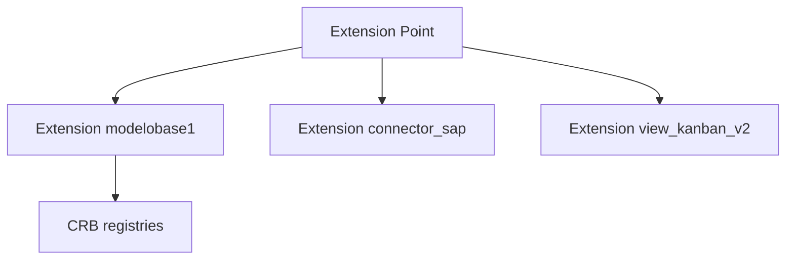

# 29 — Extension Points

> **Status:** Official SSOT · Program 4.01.1  
> **Owner topic:** Pluggable extensions without core mutation  
> **Related:** [19-MARKETPLACE.md](./19-MARKETPLACE.md) · [08-PRESENTATION-LAYER.md](./08-PRESENTATION-LAYER.md) · [RULES.md](./RULES.md) R-16, R-19

---

## Objetivo

Definir **extension points** — contratos estáveis onde templates, conectores e packs estendem a plataforma sem modificar Foundation frozen.

---

## Escopo

| In scope | Out of scope |
|----------|--------------|
| `extension_point`, `extension` objectTypes | Forking Foundation source |
| BaseTemplate plug-in | Arbitrary JS plugins in runtime |
| Connector types | |

---

## Responsabilidades

| Component | Responsibility |
|-----------|----------------|
| Platform | Register extension_point catalog |
| Publisher | Ship extension via .makpkg |
| Publish Engine | Validate compatibility |
| Runtime | Load via CRB registries only |

---

## Conceitos

- **Extension Point** — declared interface (e.g. `base_template`, `connector_type`, `view_renderer`).
- **Extension** — implementation object referencing extension point.

---

## Modelo

### Extension categories

| Point | Example extensions |
|-------|-------------------|
| `base_template` | modelobase1, future templates |
| `connector_type` | REST, MQTT, SAP |
| `view_renderer` | kanban, calendar, map |
| `formula_function` | custom function library |
| `report_exporter` | PDF, Excel |

---

## Regras

- R-16: Foundation executes; extensions supply config via CRB.
- R-19: Extension points additive.
- Extensions must declare compatible engine versions.

---

## Fluxos

Publisher registers Extension → Publish validates against ExtensionPoint contract → CRB includes → Runtime loads.

---

## Diagramas

Ver flowchart acima.

---

## Exemplos

D-MMM-05: ModeloBase1 registered as BaseTemplate extension at point `base_template`.

---

## Restrições

- No runtime dynamic code load outside signed CRB in v1.
- Extension sandbox policies via PlatformPolicy.

---

## Integrações

Marketplace, Publish C-12 template compile, Foundation registry maps.

---

## Versionamento

ExtensionPoint schema versioned; extensions declare `minPlatformVersion`.

---

## Próximos passos

- Program 4.02: extension_point PlatformSchema
- Program 4.12: extension packs in marketplace

---

*End of document.*
