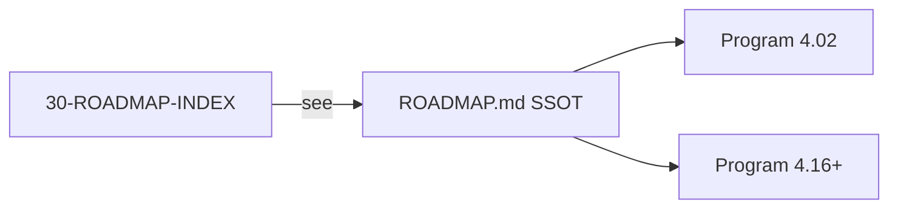

# 30 — Roadmap Index

> **Status:** Official SSOT · Program 4.01.1  
> **Owner topic:** Navigation to MMM program roadmap  
> **Related:** [ROADMAP.md](./ROADMAP.md) · [28-GOVERNANCE.md](./28-GOVERNANCE.md)

---

## Objetivo

Fornecer **ponto de entrada numerado** (doc 30) para o roadmap MMM sem duplicar conteúdo — o SSOT do roadmap é [ROADMAP.md](./ROADMAP.md).

---

## Escopo

| In scope | Out of scope |
|----------|--------------|
| Index and cross-links | Duplicate phase tables |
| Program 4.02–4.16+ pointer | Implementation tasks |

---

## Responsabilidades

| Document | Role |
|----------|------|
| **ROADMAP.md** | Canonical phase table, prerequisites, deliverables |
| **30-ROADMAP-INDEX.md** (this) | Navigation only |

---

## Conceitos

Single ownership: roadmap content lives in one file ([ROADMAP.md](./ROADMAP.md)) per enterprise documentation standard.

---

## Modelo

---

## Regras

- Do not copy phase tables into this file.
- Update [ROADMAP.md](./ROADMAP.md) when phases change.
- PROGRAM-REGISTRY must link to ROADMAP.md.

---

## Fluxos

Engineer reads 00-OVERVIEW → 30-INDEX → ROADMAP.md for implementation sequence.

---

## Diagramas

Ver flowchart acima.

---

## Exemplos

See [ROADMAP.md](./ROADMAP.md) for full convergence table 4.02–4.16+.

---

## Restrições

- No second roadmap SSOT elsewhere in repo (engineering docs may summarize with link only).

---

## Integrações

PROGRAM-REGISTRY, PROJECT-STATUS, CURRENT-STATE.

---

## Versionamento

Index version tracks meta-model doc set; roadmap version in ROADMAP.md header.

---

## Próximos passos

1. Read [ROADMAP.md](./ROADMAP.md)
2. Register active program in PROGRAM-REGISTRY
3. Begin Program 4.02 when authorized

---

*End of document.*
