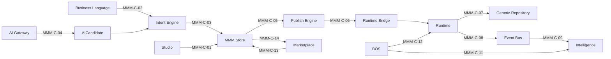

# MMM Inter-Subsystem Contracts

**Status:** Official — Integration contracts  
**Version:** 1.0.0  
**Effective date:** 2026-06-30  
**Mission:** Program 4.01.1

> **Contract IDs:** Prefixed **MMM-C-NN** (e.g. MMM-C-01). Legacy shorthand `C-NN` in diagrams refers to the same contract.

---

## Objetivo

Documentar contratos formais entre subsistemas da plataforma MAK no contexto MMM.

## Escopo

Interfaces entre Runtime, Studio, Marketplace, BOS, Intelligence, Event Bus, Publish Engine, Generic Repository.

## Responsabilidades

Este documento é o **único owner** de contratos inter-subsistema MMM.

---

## Conceitos

| Termo | Definição |
|-------|-----------|
| **Producer** | Subsistema que emite dados/eventos |
| **Consumer** | Subsistema que recebe |
| **Contract** | Schema + semantics + failure mode |

---

## Contratos

### MMM-C-01: Studio → MMM API (Write)

| Attribute | Value |
|-----------|-------|
| Producer | Studio (L4) |
| Consumer | MMM Persistence |
| Operation | CRUD objects (draft status) |
| Protocol | REST `/api/mmm/*` (future; today `/api/mdp/*` transitional) |
| Payload | MMM Envelope |
| Failure | 4xx validation error; no partial write |
| Rules | R-17 |

### MMM-C-02: Business Language → Intent Engine

| Attribute | Value |
|-----------|-------|
| Producer | BOS Business Language Wizards |
| Consumer | Intent Resolver |
| Operation | `resolveFromBusinessLanguage()` |
| Payload | BusinessIntentDocument |
| Output | DerivationPlan + preview |
| Rules | R-04, D-MMM-08 |

### MMM-C-03: Intent Engine → MMM API

| Attribute | Value |
|-----------|-------|
| Producer | Derivation Engine |
| Consumer | MMM Persistence |
| Operation | Batch create draft objects |
| Precondition | Human Confirmation |
| Lineage | intentId mandatory |

### MMM-C-04: AI Gateway → AICandidate

| Attribute | Value |
|-----------|-------|
| Producer | AI Gateway (L6) |
| Consumer | MMM Persistence |
| Operation | Create AICandidate (draft) |
| Constraint | `humanReviewRequired: true` always |
| Rules | R-03, D-MMM-09 |

### MMM-C-05: MMM → Publish Engine

| Attribute | Value |
|-----------|-------|
| Producer | MMM Persistence |
| Consumer | Publish Engine |
| Operation | Compile scope → CRB |
| Input | DefinitionVersion scope |
| Output | CompiledBundle + integrityHash |
| See | [17-PUBLISH-PIPELINE.md](./17-PUBLISH-PIPELINE.md) |

### MMM-C-06: Publish Engine → Runtime Bridge

| Attribute | Value |
|-----------|-------|
| Producer | Publish Engine |
| Consumer | Runtime Bridge (L2) |
| Operation | Hydrate registries from CRB |
| Trigger | EnvironmentPin change / app bootstrap |
| Rules | R-02, D-MMM-04 |

### MMM-C-07: Runtime → Generic Repository

| Attribute | Value |
|-----------|-------|
| Producer | Runtime (L3, BaseTemplate) |
| Consumer | Generic Repository |
| Operation | CRUD Records |
| Selection | BusinessObject.persistenceMapping |
| Rules | R-14 |

### MMM-C-08: Runtime → Event Bus

| Attribute | Value |
|-----------|-------|
| Producer | Runtime (L3) |
| Consumer | Event Bus L1 |
| Operation | Emit DomainEvent |
| Schema | DomainEvent (instance, not MMM) |
| Mandatory | AuditLog persistence |

### MMM-C-09: Event Bus → Intelligence

| Attribute | Value |
|-----------|-------|
| Producer | Event Bus |
| Consumer | Intelligence stack |
| Operation | Subscribe + ingest |
| Constraint | Read-only; never writes MMM |
| Rules | R-12 |

### MMM-C-10: Event Bus → Workflow/Automation

| Attribute | Value |
|-----------|-------|
| Producer | Event Bus |
| Consumer | Workflow/Automation engines |
| Operation | Trigger execution from MMM Event subscription |
| Precondition | CRB workflow/automation registry |

### MMM-C-11: BOS → Intelligence Event Bridge

| Attribute | Value |
|-----------|-------|
| Producer | BOS UI actions |
| Consumer | Intelligence capture |
| Operation | `intelligenceEventBridge` non-blocking |
| Constraint | Never blocks business operation |

### MMM-C-12: BOS → Runtime (Navigation)

| Attribute | Value |
|-----------|-------|
| Producer | BOS Capability catalog |
| Consumer | Runtime routes |
| Operation | Deep-link to Route → Screen |
| Source | MMM Capability + Route objects (CRB) |

### MMM-C-13: Marketplace → MMM Install

| Attribute | Value |
|-----------|-------|
| Producer | Marketplace service |
| Consumer | MMM Persistence |
| Operation | Copy snapshot objects to tenant scope |
| Constraint | New objectIds; lineage.packageId preserved |
| Rules | R-18 |

### MMM-C-14: MMM → Marketplace Export

| Attribute | Value |
|-----------|-------|
| Producer | Publish Engine |
| Consumer | Marketplace catalog |
| Operation | Create .makpkg from Snapshot |
| Output | Package + signature |

---

## Diagrama — contratos principais

---

## Restrições

- Nenhum contrato permite bypass de Publish (draft → CRB)
- Intelligence contracts are strictly read-only for MMM
- AI contracts never include direct publish

---

## Versionamento

| Version | Date | Change |
|---------|------|--------|
| 1.0.0 | 2026-06-30 | MMM-C-01 through MMM-C-14 |

## Próximos passos

- Program 4.02: OpenAPI specs per contract
- Program 4.28: Contract compliance gates
