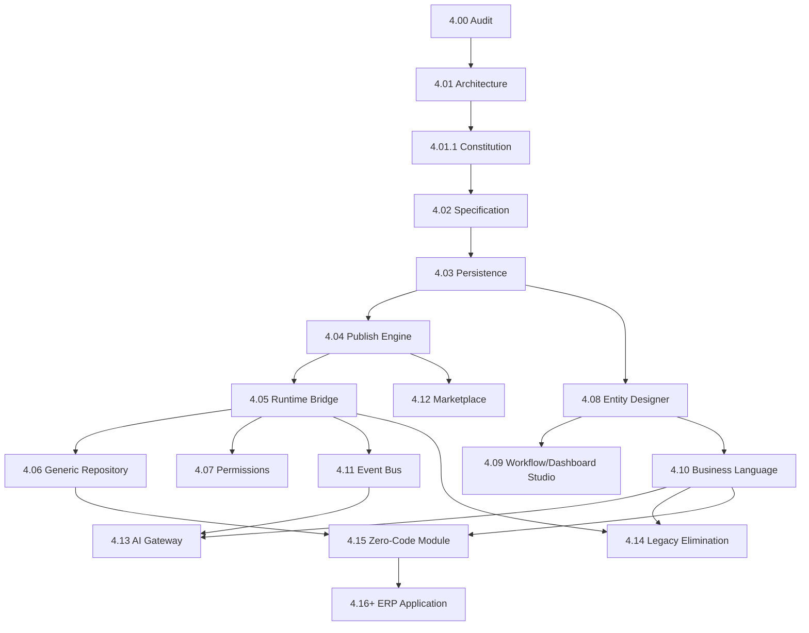

# MMM Implementation Roadmap

**Status:** Official — Program 4.02 → 4.xx sequence  
**Version:** 1.0.0  
**Effective date:** 2026-06-30  
**Mission:** Program 4.01.1  
**Owner:** This document is the **SSOT for MMM roadmap**. See [30-ROADMAP-INDEX.md](./30-ROADMAP-INDEX.md) for navigation.

---

## Objetivo

Documentar evolução prevista do MMM da especificação (4.02) até ERP-as-Application (4.16+).

## Escopo

Programs 4.02–4.16+; dependencies; deliverables; no calendar estimates.

## Responsabilidades

Sequência oficial de implementação MMM. [PROGRAM-REGISTRY.md](../engineering/PROGRAM-REGISTRY.md) references this for Program 4.x.

---

## Fases

| Program | Name | Deliverables | Prerequisite |
|---------|------|--------------|--------------|
| **4.01** | Meta Model Foundation | Architecture (chat) | 4.00 Audit ✅ |
| **4.01.1** | Meta Model Constitution | `docs/meta-model/` SSOT | 4.01 ✅ |
| **4.02** | MMM Specification | PlatformSchema 222 types; envelope spec; API contract | 4.01.1 ✅ |
| **4.03** | MMM Persistence | MDP → MMM tables; migration plan | 4.02 |
| **4.04** | Publish Engine v2 | Pipeline C-1→C-16 certified | 4.03 |
| **4.05** | Runtime Bridge v2 | Universal CRB hydration; deprecate boot cache SSOT | 4.04 |
| **4.06** | Generic Repository | EAV + 8 adapters | 4.05 |
| **4.07** | Permission Model | Role/Permission MMM + CRB enforcement | 4.05 |
| **4.08** | Studio Entity Designer | BO/Field/Relationship visual | 4.03 |
| **4.09** | Studio Workflow/Dashboard | Workflow + Dashboard designers | 4.08 |
| **4.10** | Business Language Wizards | BOS authoring; eliminate dual path | 4.08 |
| **4.11** | Event Bus L3 | Platform Core event bus (D-074 VA-07) | 4.05 |
| **4.12** | Marketplace v1 | .makpkg spec + install | 4.04 |
| **4.13** | AI Gateway | Provider-agnostic + AICandidate | 4.10, 4.11 |
| **4.14** | Legacy Elimination | Remove boot cache SSOT, cadastro legacy, static menus | 4.05–4.10 |
| **4.15** | First Zero-Code Module | Module without JS factory | 4.06–4.10 |
| **4.16+** | ERP as Application | Financeiro, Vendas, etc. as MMM packages | 4.15 |

---

## Diagrama — dependências

---

## Convergence map (legacy → MMM)

| Legacy | Target program | MMM object |
|--------|----------------|------------|
| MDP tables | 4.03 | MMM persistence |
| Boot cache JS | 4.05, 4.14 | CRB only |
| `generatedModules.json` | 4.14 | Module + Route |
| `UsuarioPerfil` | 4.07 | Role |
| ModeloBase1 | 4.05 | BaseTemplate |
| Studio catalogs | 4.02 | PlatformSchema seeds |

---

## Restrições

- **No ERP modules** before 4.15
- **No new intelligence engines** during 4.02–4.14 unless MMM-related
- **Foundation frozen** throughout (D-MMM-13)

---

## Versionamento

| Version | Date | Change |
|---------|------|--------|
| 1.0.0 | 2026-06-30 | Initial roadmap |

## Próximos passos

- Register Program 4.02 in PROGRAM-REGISTRY
- Begin 4.02 PlatformSchema authoring
