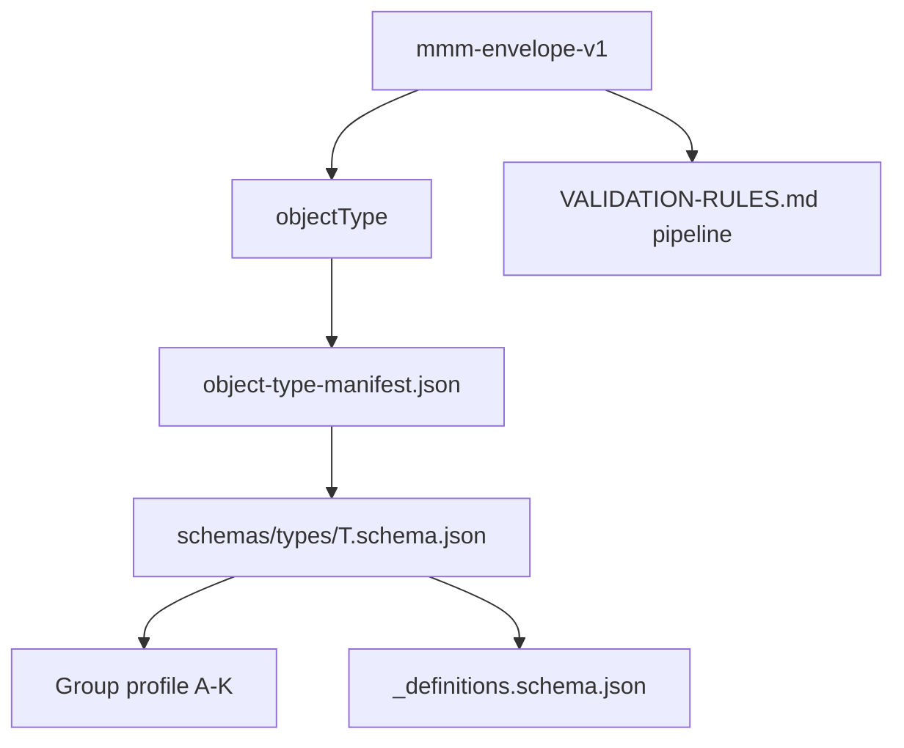

# Program 4.02 — MMM Specification Overview

**Status:** Normative specification · **Version:** 1.0.0  
**Mission:** Program 4.02 · **Decision:** D-MMM-17  
**Foundation:** Architecture docs 00–30 unchanged (reference only)

---

## Objetivo

Entregar a **especificação formal v1** do MMM: PlatformSchema (226), envelope universal, API contract, validation rules, derivation map, gate G421.

---

## Escopo entregue

| # | Entrega | Artifact |
|---|---------|----------|
| 1 | Schema canônico por objectType | `spec/schemas/types/*.schema.json` (226) |
| 2 | Envelope universal | `spec/mmm-envelope-v1.schema.json` |
| 3 | Contrato API MMM | `spec/mmm-api-v1.openapi.yaml` |
| 4 | Derivation kinds ↔ objectTypes | [DERIVATION-KIND-MAP.md](./DERIVATION-KIND-MAP.md) |
| 5 | Regras de validação | [VALIDATION-RULES.md](./VALIDATION-RULES.md) |
| 6 | Metadados obrigatórios | [METADATA-REQUIREMENTS.md](./METADATA-REQUIREMENTS.md) |
| 7 | Versionamento / compatibilidade | [VERSIONING-COMPATIBILITY.md](./VERSIONING-COMPATIBILITY.md) |
| 8 | Obrigatório / opcional / proibido | Manifest + profiles + type extensions |
| 9 | Gate G421 | [G421-SPEC.md](./G421-SPEC.md) |

---

## Representação da taxonomia

| Layer | Representation |
|-------|----------------|
| **Taxonomy SSOT** | [02-OBJECT-TAXONOMY.md](../02-OBJECT-TAXONOMY.md) — 227 names |
| **Schema manifest** | [object-type-manifest.json](./object-type-manifest.json) — 226 PlatformSchemas |
| **Payload schemas** | `schemas/types/{objectType}.schema.json` |
| **Group profiles** | `schemas/profiles/profile-{a-k}-*.schema.json` (11) |
| **Shared defs** | `schemas/_definitions.schema.json` |

---

## Modelo de schema

---

## Fora de escopo (4.02)

- Implementação backend `/api/mmm/*`
- Persistência MMM tables (4.03)
- Publish Engine (4.04)
- Runtime / CRB loader (4.05)
- Gate script G421 (4.03 prep — spec only registered)
- UI / Studio designers

---

## Próximo program

**4.03 — MMM Persistence** — implement storage using this spec bundle (`mmm-spec-v1`).

---

*End of document.*
