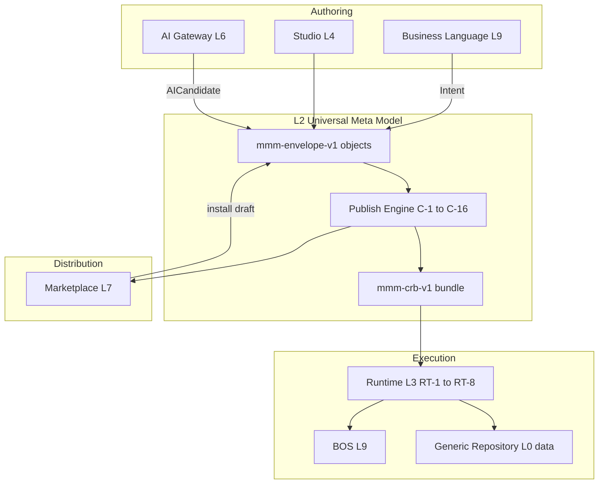

# 00 — Platform Overview

**Status:** Official SSOT · **Version:** 1.0.0 · **Decision:** D-PA-01

---

## What is the platform?

**MAK Gestão** is a **metadata-driven Enterprise Operating System (Business Operating System)** — a multi-tenant platform where business definitions live in the **Universal Meta Model (MMM)**, are authored via **Business Language** and **Studio**, compiled through the **Publish Engine** into **CRB bundles**, and executed by the **Runtime** for end users via the **Business Operating Shell (BOS)**.

MAK is **not** a traditional module-centric ERP. ERP, CRM, WMS, and RH are **Applications** packaged as MMM object graphs.

---

## Objective

Enable any organization to **design, publish, and operate** business systems without writing application code — with optional AI acceleration, marketplace distribution, and corporate intelligence — under enterprise security and compliance.

---

## Products (frozen catalog)

| Product | Layer | User | SSOT |
|---------|-------|------|------|
| **MAK Platform** | L0–L2 | Platform operator | This folder |
| **MAK Studio** | L4 | Expert author | [03-STUDIO.md](./03-STUDIO.md) |
| **MAK Runtime** | L3 | All end users (invisible) | [02-RUNTIME.md](./02-RUNTIME.md) |
| **MAK BOS** | L9 | Business user | [11-BOS.md](./11-BOS.md) |
| **MAK Marketplace** | L7 | Tenant admin / ISV | [12-MARKETPLACE.md](./12-MARKETPLACE.md) |
| **MAK Intelligence** | L10 | Business leader | [10-AI-ARCHITECTURE.md](./10-AI-ARCHITECTURE.md) |
| **MAK Applications** | L8 | Tenant | ERP, CRM, WMS, RH packages |

---

## Modules (conceptual)

Modules are **MMM `module` objects** inside an **Application**. Examples today (legacy cadastro): `empresas`, `cadcps`. Target: all modules are MMM-published, zero JS factory.

| Class | Examples | Source |
|-------|----------|--------|
| Platform modules | auth, tenant, audit | L1 Core |
| Application modules | financeiro, vendas, estoque | L8 packages |
| Infrastructure modules | mmm, mdp (transitional) | L2/L1 |

---

## End-to-end flow

---

## Component placement

| Concern | Layer | Component |
|---------|-------|-----------|
| Definitions SSOT | L2 | MMM object graph |
| Persistence | L2 + L0 | MMM tables + PostgreSQL |
| Compile | L2 | Publish Engine |
| Execute UI | L3 | Runtime + Render Engine |
| Author visually | L4 | Studio designers |
| Business vocabulary | L5 + L9 | Intent + Business Language |
| AI assist | L6 | AI Gateway |
| Package exchange | L7 | Marketplace |
| Deployable apps | L8 | Application packages |
| User home | L9 | BOS |
| Analytics/AI insight | L10 | Corporate Intelligence |
| Auth, events, jobs | L1 | Platform Core |
| Cloud, DB, CDN | L0 | Infrastructure |

---

## Foundation status (2026-06-30)

| Foundation | Status |
|------------|--------|
| A — Constitution + Identity | ✅ Frozen |
| B — Universal Meta Model (4.01–4.04) | ✅ Spec + persistence + publish implemented |
| C — Runtime Bridge universal | ⏳ Foundation C |
| D — Studio MMM-native | ⏳ Foundation D |
| E — Legacy elimination | ⏳ Foundation E |

See [18-FOUNDATION-ROADMAP.md](./18-FOUNDATION-ROADMAP.md).

---

## Integrations

- MMM: [docs/meta-model/](../meta-model/)
- Product identity: [MAK-PRODUCT-IDENTITY-FREEZE.md](../architecture/MAK-PRODUCT-IDENTITY-FREEZE.md)
- Master map (legacy layers): [MAK-2035-MASTER-ARCHITECTURE.md](../architecture/MAK-2035-MASTER-ARCHITECTURE.md)

---

*End of document.*
